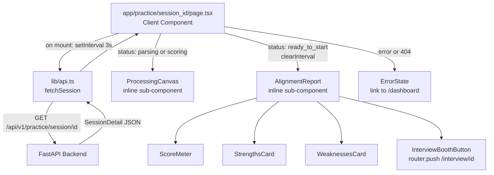

# Design Document: Frontend Phase 2 — Async State Polling Loop & Alignment Report View

## Overview

This phase replaces the Phase 1 placeholder at `app/practice/[session_id]/page.tsx` with a fully functional client component. The page has two distinct rendering modes driven by session status:

1. **Processing mode** — while `status` is `"parsing"` or `"scoring"`, a status-specific loading canvas is shown and a `setInterval` polling loop queries the session detail endpoint every 3 seconds.
2. **Report mode** — once `status` transitions to `"ready_to_start"`, the interval is cleared and the alignment report card is rendered with the score, strengths, weaknesses, and the interview booth CTA.

No new route files are created. The only new page-level file is the replacement of the existing placeholder. Supporting changes are limited to `lib/api.ts` (one new function) and `types/session.ts` (two new interfaces).

---

## Architecture



### Key Design Decisions

- All sub-components (`ProcessingCanvas`, `AlignmentReport`, `ScoreMeter`, `StrengthsCard`, `WeaknessesCard`) are defined as local functions within the page file rather than separate component files. The page is self-contained and these sub-components have no reuse surface outside this page.
- The interval handle is stored in `useRef<ReturnType<typeof setInterval> | null>` — not in state — so clearing it does not trigger a re-render.
- A single `useEffect` owns the full polling lifecycle: starts the interval on mount, clears it when status reaches `ready_to_start` or an error occurs, and clears it again in the cleanup function for unmount safety.
- The `fetchSession` function in `lib/api.ts` follows the exact same `handleResponse` pattern already established in Phase 1, keeping the API client consistent.
- Error state is terminal: once set, the polling loop stops and the error UI is shown. No retry logic is introduced in this phase.

---

## Components and Interfaces

### File Changes

```
frontend/
├── app/
│   └── practice/
│       └── [session_id]/
│           └── page.tsx          # REPLACE placeholder — full implementation
├── lib/
│   └── api.ts                    # ADD fetchSession() function
└── types/
    └── session.ts                # ADD SessionDetail + ResumeReport interfaces
```

No new files are created outside these three.

---

### `app/practice/[session_id]/page.tsx`

The entire page is a single `"use client"` component. It owns all state and the polling lifecycle.

**State shape:**

```typescript
const [status, setStatus] = useState<string | null>(null);
const [resumeReport, setResumeReport] = useState<ResumeReport | null>(null);
const [error, setError] = useState<string | null>(null);
const intervalRef = useRef<ReturnType<typeof setInterval> | null>(null);
```

**Polling lifecycle (`useEffect`):**

```typescript
useEffect(() => {
  const poll = async () => {
    try {
      const data = await fetchSession(sessionId);
      setStatus(data.status);
      if (data.status === 'ready_to_start') {
        clearInterval(intervalRef.current!);
        setResumeReport(data.resume_report);
      }
    } catch (err) {
      clearInterval(intervalRef.current!);
      setError(err instanceof ApiError ? err.detail : 'Failed to load session.');
    }
  };

  poll(); // fire immediately on mount
  intervalRef.current = setInterval(poll, 3000);

  return () => {
    if (intervalRef.current) clearInterval(intervalRef.current);
  };
}, [sessionId]);
```

Firing `poll()` immediately on mount avoids a 3-second blank screen before the first data arrives.

**Render logic:**

```
if error → <ErrorState />
else if status === 'ready_to_start' && resumeReport → <AlignmentReport />
else → <ProcessingCanvas status={status} />
```

---

### `ProcessingCanvas` (inline sub-component)

Renders the dark-mode loading state. Accepts `status: string | null` as a prop.

Status-to-message mapping:

| Status | Message |
|---|---|
| `"parsing"` | "Aria is parsing your resume structural text layout..." |
| `"scoring"` | "Gemini is cross-referencing your background history against the target Job Description..." |
| other / null | "Initializing your practice session..." |

Visual structure: full-height centered column (`flex flex-col items-center justify-center min-h-screen bg-slate-900`), animated pulse ring or spinner, status message in `text-zinc-400`, and a secondary label showing the current status string in a muted badge.

---

### `AlignmentReport` (inline sub-component)

Renders the three-section report card once `resume_report` is available. Accepts `report: ResumeReport` and `sessionId: string`.

Sections:
1. `ScoreMeter` — score badge with conditional color tier
2. `StrengthsCard` + `WeaknessesCard` — side-by-side responsive flex layout
3. Interview booth CTA button

---

### `ScoreMeter` (inline sub-component)

Renders the score as a large circular badge. Accepts `score: number`.

Color tier logic:

```typescript
function getScoreColor(score: number): string {
  if (score >= 75) return 'text-emerald-400 border-emerald-500/40';
  if (score >= 60) return 'text-indigo-400 border-indigo-500/40';
  return 'text-amber-400 border-amber-500/40';
}
```

The badge is a `div` with a circular border, large font size, and the score centered inside. Below it, `reference_to_jd` is rendered as a paragraph in `text-zinc-400`.

Score tier labels displayed alongside the badge:
- ≥75: "High Alignment"
- ≥60: "Moderate Alignment"
- <60: "Gaps Flagged"

---

### `StrengthsCard` and `WeaknessesCard` (inline sub-components)

Both accept a `string[]` prop and render a card with a header and a list of items.

`StrengthsCard`: header "Core Strengths", each item prefixed with a `lucide-react CheckCircle2` icon in `text-emerald-400`.

`WeaknessesCard`: header "Preparation Gaps", each item prefixed with a `lucide-react AlertTriangle` icon in `text-amber-400`.

Both cards use `bg-slate-800/50 border border-slate-700 rounded-xl p-6` for consistent styling with the Phase 1 design system. Empty arrays render the card header with no list items — no error, no special empty state message needed.

---

### `ErrorState` (inline sub-component)

Renders when `error` is set. Displays the error message and a `<Link href="/dashboard">` back to the dashboard. Uses `text-red-400` for the error text and a standard indigo-styled link button.

---

### `lib/api.ts` — `fetchSession` addition

```typescript
export async function fetchSession(sessionId: string): Promise<SessionDetail> {
  const res = await fetch(`${API_BASE}/practice/session/${sessionId}`);
  return handleResponse<SessionDetail>(res);
}
```

Reuses the existing `handleResponse` and `ApiError` — no new error handling patterns introduced.

---

### `types/session.ts` — new interfaces

```typescript
export interface ResumeReport {
  score: number;
  reference_to_jd: string;
  strengths: string[];
  weaknesses: string[];
}

export interface SessionDetail {
  session_id: string;
  status: string;
  created_at: string;
  job: JobSummary;
  resume_report: ResumeReport | null;
  resume_score: number | null;
}
```

`SessionDetail` extends the existing `JobSummary` type already defined in `types/session.ts`.

---

## Data Models

### `GET /api/v1/practice/session/{session_id}` response shape consumed

```json
{
  "session_id": "uuid-string",
  "status": "ready_to_start",
  "created_at": "2024-01-15T10:30:00Z",
  "job": { "id": "uuid-string", "title": "Senior Software Engineer" },
  "resume_score": 82,
  "resume_report": {
    "score": 82,
    "reference_to_jd": "Candidate matches 82% of the job description requirements.",
    "strengths": ["Strong Python skills", "Relevant API experience"],
    "weaknesses": ["No Kubernetes experience", "Limited frontend exposure"]
  }
}
```

During `"parsing"` and `"scoring"` states, `resume_report` will be `null` — the component handles this by staying in `ProcessingCanvas` mode.

---

## Error Handling

| Scenario | Behavior |
|---|---|
| Polling request returns 404 | `ApiError` thrown → `setError` → polling stops → `ErrorState` with dashboard link |
| Polling request returns 5xx | `ApiError` thrown → `setError` → polling stops → `ErrorState` with dashboard link |
| Network failure during poll | Caught in `catch` → `setError` → polling stops → `ErrorState` with dashboard link |
| `resume_report` is null when status is `ready_to_start` | Defensive check: stay in `ProcessingCanvas` until report is non-null |
| Unknown status value | `ProcessingCanvas` renders the generic "Initializing..." message — no crash |
| Component unmounts while polling | `useEffect` cleanup calls `clearInterval` — no ghost requests |

---

## Testing Strategy

Tests live in `frontend/__tests__/` following the Phase 1 pattern using Vitest and React Testing Library.

Key test cases:

- Renders `ProcessingCanvas` with the `"parsing"` message when initial status is `"parsing"`.
- Renders `ProcessingCanvas` with the `"scoring"` message when status updates to `"scoring"`.
- Transitions to `AlignmentReport` when status becomes `"ready_to_start"` and `resume_report` is populated.
- `ScoreMeter` applies emerald classes for score ≥75, indigo for ≥60, amber for <60.
- `StrengthsCard` and `WeaknessesCard` render correct item counts from mock arrays.
- `StrengthsCard` and `WeaknessesCard` render without error when passed empty arrays.
- `ErrorState` renders when `fetchSession` throws an `ApiError`.
- `clearInterval` is called when status reaches `"ready_to_start"`.
- `clearInterval` is called on component unmount.
