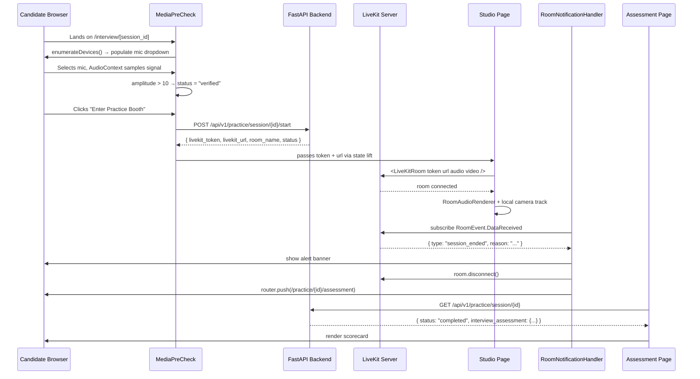

# Design Document — Frontend Phase 3: LiveKit WebRTC Voice Studio & Assessment Scorecard

## Overview

Phase 3 adds three new UI surfaces to the Candidate Portal:

1. `components/MediaPreCheck.tsx` — a pre-join device verification widget that gates entry to the live room behind a confirmed microphone signal check.
2. `app/interview/[session_id]/page.tsx` — the live WebRTC studio page that mounts `<LiveKitRoom>`, renders local video and remote audio, and hosts the `RoomNotificationHandler` data channel listener.
3. `app/practice/[session_id]/assessment/page.tsx` — the post-interview scorecard page that polls for `status: "completed"` and renders the full `InterviewAssessmentSchema` payload.

Two supporting additions are also required:
- New TypeScript types in `frontend/types/session.ts` for `StartSessionResponse` and `InterviewAssessment`.
- A new `startSession` API function in `frontend/lib/api.ts`.
- Installation of `livekit-client` and `@livekit/components-react` as production dependencies.

---

## Architecture



---

## Components and Interfaces

### 1. New TypeScript Types (`frontend/types/session.ts`)

Two new interfaces are appended to the existing file:

```typescript
export interface StartSessionResponse {
  livekit_token: string;
  livekit_url: string;
  room_name: string;
  status: string;
}

export interface DimensionScore {
  score: number;
  max_score: number;
  label: string;
  verdict: string;
  evidence: string;
  strengths: string[];
  gaps: string[];
}

export interface InterviewAssessment {
  overall_score: number;
  practice_verdict: string;
  summary: string;
  dimension_scores: Record<string, DimensionScore>;
  overall_strengths: string[];
  overall_gaps: string[];
  technical_round_probes: string[];
  turns_analyzed: number;
  completion_ratio: number;
}
```

`SessionDetail` is extended with an `interview_assessment` field:

```typescript
export interface SessionDetail {
  // ...existing fields...
  interview_assessment: InterviewAssessment | null;
}
```

### 2. New API Function (`frontend/lib/api.ts`)

```typescript
export async function startSession(sessionId: string): Promise<StartSessionResponse> {
  const res = await fetch(`${API_BASE}/practice/session/${sessionId}/start`, {
    method: "POST",
  });
  return handleResponse<StartSessionResponse>(res);
}
```

### 3. `components/MediaPreCheck.tsx`

**Props:**
```typescript
interface MediaPreCheckProps {
  sessionId: string;
  onReady: (token: string, url: string) => void;
}
```

**Internal state:**
| State | Type | Purpose |
|---|---|---|
| `devices` | `MediaDeviceInfo[]` | Available `audioinput` devices |
| `selectedDeviceId` | `string \| null` | Currently selected mic device ID |
| `micStatus` | `"idle" \| "checking" \| "verified" \| "error"` | Microphone verification state |
| `errorMessage` | `string \| null` | Permission or device error text |
| `isLoading` | `boolean` | POST request in-flight guard |

**Key logic:**

- On mount: call `enumerateDevices()`, filter `audioinput`, set `devices`.
- On device select: call `getUserMedia({ audio: { deviceId } })`. On success, create `AudioContext`, connect `AnalyserNode`, start a `setInterval` at 100ms sampling `getByteFrequencyData` and computing average. If average > 10, set `micStatus = "verified"`. On `NotAllowedError`/`NotFoundError`, set `micStatus = "error"` and `errorMessage`.
- On unmount: stop all `MediaStreamTrack` instances, close `AudioContext`, clear the sampling interval.
- On "Enter Practice Booth" click: call `startSession(sessionId)`, then call `onReady(token, url)`.

**Render structure:**
```
<main bg-slate-900>
  <h2> Microphone Check </h2>
  <select> {devices} </select>
  <SignalBars amplitude={currentAmplitude} />
  {micStatus === "verified" && <GreenBadge />}
  {micStatus === "error" && <ErrorMessage />}
  <button disabled={micStatus !== "verified" || isLoading}>
    Enter Practice Booth
  </button>
</main>
```

`SignalBars` is a small inline sub-component rendering 5 vertical bars whose heights scale with the current amplitude value, styled with Tailwind.

### 4. `app/interview/[session_id]/page.tsx` — Studio Page

**Page-level state:**
| State | Type | Purpose |
|---|---|---|
| `livekitToken` | `string \| null` | Token from MediaPreCheck |
| `livekitUrl` | `string \| null` | Server URL from MediaPreCheck |
| `alertMessage` | `string \| null` | Watchdog banner text |

**Render flow:**

```
if (!livekitToken) → render <MediaPreCheck onReady={setTokenAndUrl} />
else → render <LiveKitRoom token url audio video>
              <RoomAudioRenderer />
              <LocalCameraPanel />
              <RoomNotificationHandler sessionId alertMessage setAlertMessage />
              {alertMessage && <AlertBanner message />}
              <EndSessionButton />
           </LiveKitRoom>
```

**`LocalCameraPanel`** is an inline component using the `useTracks` hook:
```typescript
const tracks = useTracks([{ source: Track.Source.Camera, withPlaceholder: true }], {
  onlySubscribed: false,
});
// renders the first local track via <VideoTrack />
```

**`EndSessionButton`** uses the `useRoomContext` hook to access `room.disconnect()`.

### 5. `RoomNotificationHandler` (inner component of Studio Page)

**Props:**
```typescript
interface RoomNotificationHandlerProps {
  sessionId: string;
  setAlertMessage: (msg: string) => void;
}
```

**Logic:**
- Uses `useRoomContext()` to get the `room` instance.
- Uses `useRouter()` for navigation.
- In a `useEffect`, registers `room.on(RoomEvent.DataReceived, handler)`.
- Handler: decode `Uint8Array` → `TextDecoder` → `JSON.parse`. On parse failure, return silently. On `type === "session_ended"`, set alert message based on `reason`, call `room.disconnect()`.
- Registers `room.on(RoomEvent.Disconnected, () => router.push(...))`.
- Cleanup: `room.off(...)` on unmount.

### 6. `app/practice/[session_id]/assessment/page.tsx` — Assessment Page

**Page-level state:**
| State | Type | Purpose |
|---|---|---|
| `assessment` | `InterviewAssessment \| null` | Resolved assessment payload |
| `error` | `string \| null` | Fetch error message |

**Polling logic:** mirrors the existing `PracticeSessionPage` pattern — `setInterval` at 3000ms calling `fetchSession`, clearing on `status === "completed"` or error, clearing on unmount via `useEffect` cleanup.

**Render structure:**

```
<main bg-slate-900>
  <VerdictHeader overall_score practice_verdict />
  <CompletionCallout completion_ratio turns_analyzed />
  <DimensionGrid dimension_scores />
  <TechnicalProbesGrid technical_round_probes />
</main>
```

Sub-components (all inline within the file):

- **`VerdictHeader`**: Large centered card with `practice_verdict` text and `overall_score` circle badge. Color-coded by score range (≥80 emerald, ≥68 indigo, ≥52 amber, <52 red).
- **`CompletionCallout`**: Shows `(completion_ratio * 100).toFixed(0)%` with a progress bar and `turns_analyzed` count.
- **`DimensionGrid`**: Maps `Object.entries(dimension_scores)` to `DimensionCard` components in a 2-column responsive grid.
- **`DimensionCard`**: Renders `label`, `score/100`, `verdict` badge, `evidence` quote, and `gaps` bullet list.
- **`TechnicalProbesGrid`**: Renders `technical_round_probes` as a 3-column grid of numbered probe cards.

---

## Data Models

### `StartSessionResponse` (from `POST /api/v1/practice/session/{id}/start`)

```json
{
  "livekit_token": "<signed JWT>",
  "livekit_url": "ws://localhost:7880",
  "room_name": "practice-room-<session_id>",
  "status": "interviewing"
}
```

### `InterviewAssessment` (from `GET /api/v1/practice/session/{id}` when `status === "completed"`)

```json
{
  "overall_score": 74,
  "practice_verdict": "Strong Alignment",
  "summary": "...",
  "dimension_scores": {
    "technical":      { "score": 78, "label": "Technical Familiarity", "verdict": "Good", "evidence": "...", "strengths": [...], "gaps": [...] },
    "role_alignment": { "score": 70, "label": "Role Alignment",        "verdict": "Good", "evidence": "...", "strengths": [...], "gaps": [...] },
    "communication":  { "score": 72, "label": "Communication",         "verdict": "Good", "evidence": "...", "strengths": [...], "gaps": [...] },
    "presence":       { "score": 65, "label": "Presence",              "verdict": "Fair", "evidence": "...", "strengths": [...], "gaps": [...] }
  },
  "overall_strengths": [...],
  "overall_gaps": [...],
  "technical_round_probes": ["...", "...", "..."],
  "turns_analyzed": 22,
  "completion_ratio": 0.875
}
```

### Extended `SessionDetail` type

The existing `SessionDetail` interface gains one new optional field:

```typescript
interview_assessment: InterviewAssessment | null;
```

---

## Error Handling

| Scenario | Component | Handling |
|---|---|---|
| `getUserMedia` → `NotAllowedError` | MediaPreCheck | Set `micStatus = "error"`, show troubleshooting text, disable join button |
| `getUserMedia` → `NotFoundError` | MediaPreCheck | Set `micStatus = "error"`, show "No microphone found" message |
| `startSession` POST fails | MediaPreCheck | Show inline error, re-enable button, do not navigate |
| LiveKit room connection error | Studio Page | Render error banner with reason string and `/dashboard` link |
| DataReceived payload is not valid JSON | RoomNotificationHandler | Silent discard, no state update |
| Assessment fetch fails | Assessment Page | Render error message + `/dashboard` link |
| Assessment page unmounts during poll | Assessment Page | `clearInterval` in `useEffect` cleanup |
| `interview_assessment` is null on `completed` status | Assessment Page | Show "Assessment is still processing..." with a retry link |

---

## Dependency Installation

`livekit-client` and `@livekit/components-react` are not yet in `package.json`. They must be added before implementation:

```
npm install livekit-client @livekit/components-react
```

Exact versions to pin (current stable as of May 2026):
- `livekit-client`: `^2.x`
- `@livekit/components-react`: `^2.x`

---

## Testing Strategy

Tests live in `frontend/__tests__/` using Vitest + `@testing-library/react`.

- **`MediaPreCheck.test.tsx`**: Mock `navigator.mediaDevices.getUserMedia` and `enumerateDevices`. Assert permission error state disables the button. Assert verified state enables the button. Assert `startSession` is called on click.
- **`InterviewStudioPage.test.tsx`**: Mock `@livekit/components-react` hooks. Assert `MediaPreCheck` renders before token is set. Assert `LiveKitRoom` renders after token is set.
- **`AssessmentPage.test.tsx`**: Mock `fetchSession` returning a `completed` session with a full `InterviewAssessment`. Assert `practice_verdict`, `overall_score`, all 4 dimension labels, and all 3 probe strings render. Assert polling clears on unmount.

All LiveKit SDK imports are mocked at the module level in test files to avoid WebRTC environment requirements in jsdom.
