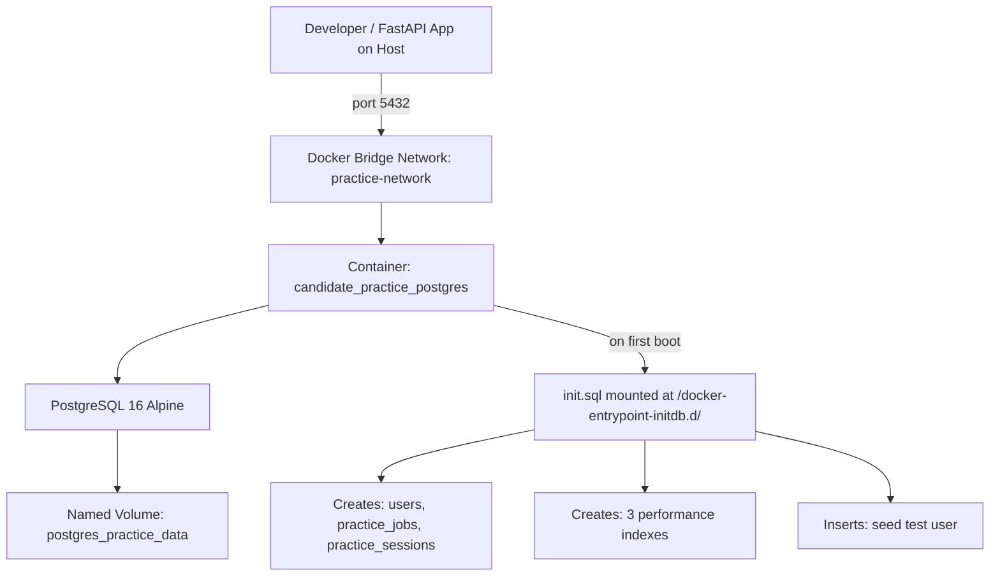
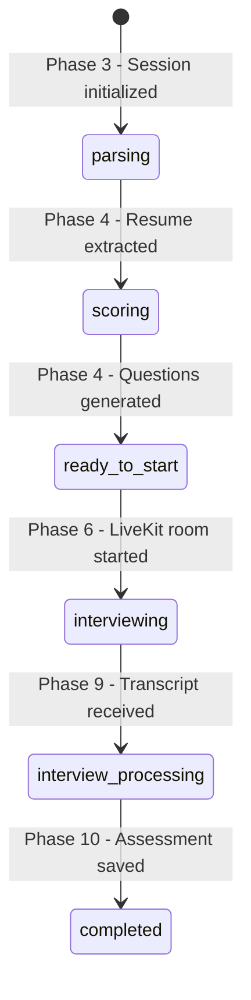

# Design Document: Phase 1 — Local PostgreSQL Infrastructure via Docker

## Overview

This document describes the technical design for provisioning the local PostgreSQL database that underpins the entire Candidate Interview Practice Portal. The scope is limited to infrastructure setup: the Docker Compose service definition, the SQL initialization script, and the seed data. No application code is written in this phase. The output is a running, healthy PostgreSQL container with the correct schema that all subsequent FastAPI phases can connect to.

---

## Architecture

The local development stack uses a single Docker Compose file at the project root. The database container runs in an isolated bridge network, exposes port `5432` to the host for direct client access (e.g., psql, DBeaver, or the FastAPI asyncpg driver), and persists data to a named Docker volume so the schema and seed data survive container restarts.



The `init.sql` file is the single source of truth for the schema. PostgreSQL's `docker-entrypoint-initdb.d` mechanism guarantees it runs exactly once — on the very first container initialization when the data volume is empty. Subsequent restarts skip it, so the `IF NOT EXISTS` and `ON CONFLICT` guards are defensive measures for edge cases (e.g., volume deletion and re-creation).

---

## Components and Interfaces

### 2.1. `docker-compose.yml` (Project Root)

The sole infrastructure orchestration file. Defines one service, one network, and one volume.

| Property | Value |
|---|---|
| Service name | `practice-db` |
| Image | `postgres:16-alpine` |
| Container name | `candidate_practice_postgres` |
| Host port | `5432` |
| Container port | `5432` |
| Restart policy | `unless-stopped` |
| Network | `practice-network` (bridge) |
| Data volume | `postgres_practice_data` → `/var/lib/postgresql/data` |
| Init script mount | `./database/init.sql` → `/docker-entrypoint-initdb.d/init.sql` |
| Health check command | `pg_isready -U practice_user -d interview_practice_db` |
| Health check interval | 10s |
| Health check timeout | 5s |
| Health check retries | 5 |

**Design Decision**: Using `postgres:16-alpine` keeps the image footprint minimal (~80MB vs ~400MB for the full Debian image). Alpine is sufficient for a local dev database with no OS-level extensions beyond `uuid-ossp`.

### 2.2. `database/init.sql`

The SQL script that bootstraps the schema. It is structured in four logical sections executed top-to-bottom:

1. Extension activation
2. Table creation (in dependency order: `users` → `practice_jobs` → `practice_sessions`)
3. Index creation
4. Seed data insertion

**Design Decision**: Tables are created in strict FK dependency order. `practice_jobs` references `users`, and `practice_sessions` references both. Creating them out of order would cause FK constraint failures.

---

## Data Models

### 3.1. `users` Table

Represents the candidate's account. In this single-user practice portal, this table will typically hold one row (the seeded test user) until a real authentication layer is added in a later phase.

| Column | Type | Constraints | Notes |
|---|---|---|---|
| `id` | UUID | PK, DEFAULT uuid_generate_v4() | Auto-generated |
| `email` | VARCHAR(255) | UNIQUE, NOT NULL | Login identifier |
| `hashed_password` | VARCHAR(255) | NOT NULL | bcrypt hash |
| `full_name` | VARCHAR(255) | NOT NULL | Display name |
| `is_active` | BOOLEAN | DEFAULT true, NOT NULL | Soft-disable flag |
| `created_at` | TIMESTAMPTZ | DEFAULT now() | Audit field |
| `updated_at` | TIMESTAMPTZ | DEFAULT now() | Audit field |

### 3.2. `practice_jobs` Table

Stores the target Job Description the candidate uploads for a practice session. Decoupled from `practice_sessions` to allow future reuse of a JD across multiple sessions.

| Column | Type | Constraints | Notes |
|---|---|---|---|
| `id` | UUID | PK, DEFAULT uuid_generate_v4() | Auto-generated |
| `user_id` | UUID | FK → users.id ON DELETE CASCADE, NOT NULL | Ownership |
| `title` | VARCHAR(255) | NOT NULL | Defaults to "Target Job Role" if not provided |
| `description` | TEXT | NOT NULL | Raw pasted JD text |
| `jd_parsed` | JSONB | nullable | Reserved for future LLM-structured JD parsing |
| `created_at` | TIMESTAMPTZ | DEFAULT now() | Audit field |
| `updated_at` | TIMESTAMPTZ | DEFAULT now() | Audit field |

### 3.3. `practice_sessions` Table

The central entity of the entire application. One row represents one complete interview practice attempt, from upload through final assessment. All LLM pipeline outputs are stored as JSONB columns on this single row, updated progressively as background tasks complete.

| Column | Type | Constraints | Notes |
|---|---|---|---|
| `id` | UUID | PK, DEFAULT uuid_generate_v4() | Auto-generated |
| `user_id` | UUID | FK → users.id ON DELETE CASCADE, NOT NULL | Ownership |
| `job_id` | UUID | FK → practice_jobs.id ON DELETE CASCADE, NOT NULL | Linked JD |
| `resume_url` | VARCHAR(500) | nullable | Local file path or storage URL |
| `resume_parsed` | JSONB | nullable | Output of Phase 4 Pipeline 1 (LLM resume extraction) |
| `resume_report` | JSONB | nullable | Output of Phase 4 Pipeline 2 (score, strengths, gaps) |
| `generated_questions` | JSONB | nullable | Output of Phase 4 Pipeline 2 (8 custom questions array) |
| `status` | VARCHAR(50) | DEFAULT 'parsing', NOT NULL | State machine field (see below) |
| `livekit_room_name` | VARCHAR(255) | nullable | Set in Phase 6 when room is created |
| `transcript` | JSONB | nullable | Set in Phase 9 after interview ends |
| `interview_assessment` | JSONB | nullable | Set in Phase 10 after grading pipeline |
| `created_at` | TIMESTAMPTZ | DEFAULT now() | Audit field |
| `updated_at` | TIMESTAMPTZ | DEFAULT now() | Audit field |

#### Session Status State Machine

The `status` column is the primary mechanism for the frontend to track pipeline progress. Transitions are strictly sequential and driven by background task completions.



### 3.4. Indexes

Three indexes are created to optimize the two most frequent query patterns in the application:

| Index Name | Table | Column | Purpose |
|---|---|---|---|
| `idx_practice_jobs_user_id` | `practice_jobs` | `user_id` | Fast lookup of all jobs belonging to a user |
| `idx_practice_sessions_user_id` | `practice_sessions` | `user_id` | Fast lookup of all sessions for the dashboard list |
| `idx_practice_sessions_status` | `practice_sessions` | `status` | Fast filtering by pipeline state for polling queries |

**Design Decision**: No index is placed on `created_at` at this stage. The dashboard ordering query (`ORDER BY created_at DESC`) will use a sequential scan on the small dataset typical of a single-user practice portal. This can be revisited if the session count grows significantly.

---

## Error Handling

Since this phase contains no application code, error handling is addressed at the infrastructure level:

| Scenario | Handling Mechanism |
|---|---|
| Container fails to start | Docker `restart: unless-stopped` policy automatically retries |
| PostgreSQL not ready when app connects | Health check with 5 retries prevents dependent services from starting prematurely |
| `init.sql` run on a pre-existing volume | `CREATE TABLE IF NOT EXISTS` and `CREATE INDEX IF NOT EXISTS` guards prevent errors |
| Seed user already exists | `ON CONFLICT (email) DO NOTHING` silently skips the duplicate insert |
| Port 5432 already in use on host | Docker Compose will fail with a clear bind error; developer must free the port |

---

## Testing Strategy

Phase 1 has no unit-testable application code. Verification is performed via two manual CLI commands after running `docker compose up -d practice-db`:

**Test 1 — Container Health**
```bash
docker compose ps
```
Expected: `practice-db` service shows status `healthy`.

**Test 2 — Schema Verification**
```bash
docker exec -it candidate_practice_postgres psql -U practice_user -d interview_practice_db -c "\dt"
```
Expected output includes all three tables: `users`, `practice_jobs`, `practice_sessions`.

**Test 3 — Seed Data Verification**
```bash
docker exec -it candidate_practice_postgres psql -U practice_user -d interview_practice_db -c "SELECT id, email, full_name FROM users;"
```
Expected: One row with `id = a1b2c3d4-e5f6-7a8b-9c0d-1e2f3a4b5c6d` and `email = test.candidate@example.com`.

**Test 4 — Index Verification**
```bash
docker exec -it candidate_practice_postgres psql -U practice_user -d interview_practice_db -c "\di"
```
Expected: Lists `idx_practice_jobs_user_id`, `idx_practice_sessions_user_id`, `idx_practice_sessions_status`.
