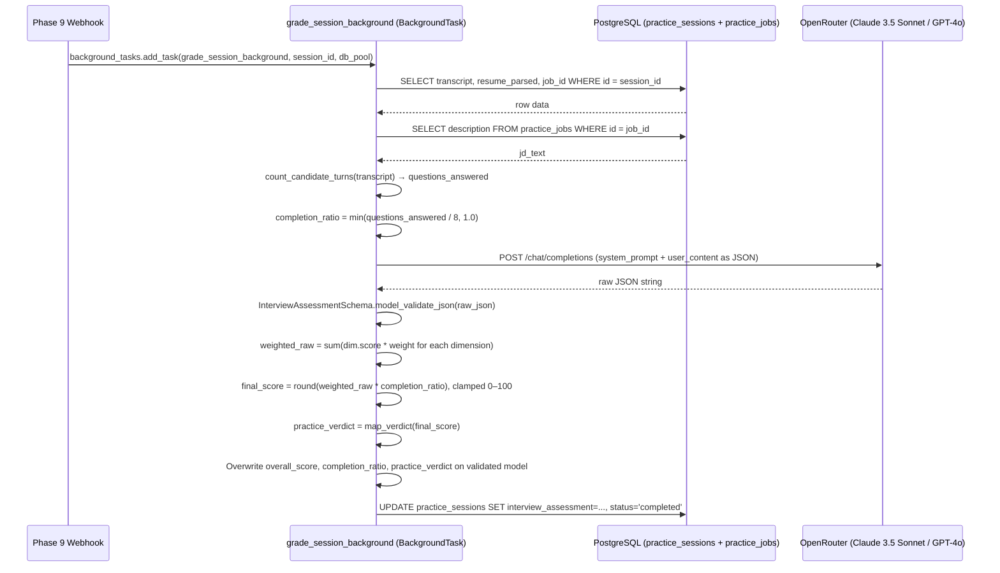

# Design Document — Phase 10: Performance Evaluation & Completion-Weighted Grading Pipeline

## Overview

Phase 10 replaces the `grade_session_background` stub in `services/background_pipeline.py` with the real Pipeline 3 grading engine. When triggered by the Phase 9 webhook, it fetches the session transcript, parsed resume, and job description from the database, constructs a structured LLM prompt, calls OpenRouter with a high-tier model, validates the response against `InterviewAssessmentSchema`, applies the completion-weighted scoring formula, and commits the final assessment to `practice_sessions.interview_assessment` while advancing the status to `completed`.

Two files are modified: `services/background_pipeline.py` (replace the stub) and `config.py` (add a grading model setting). One new schema file may be needed if `schemas/assessment.py` requires extension — but based on the existing schema it is already complete.

---

## Architecture



---

## Components and Interfaces

### 1. `services/background_pipeline.py` — replace `grade_session_background`

The stub is replaced with the full implementation. All new logic is contained in this single function plus two pure helper functions.

#### `count_candidate_turns(transcript: list[dict]) -> int`

Pure helper. Counts transcript entries where `speaker == "candidate"` and `text` is non-empty after stripping whitespace.

```python
def count_candidate_turns(transcript: list[dict]) -> int:
    return sum(
        1 for turn in transcript
        if turn.get("speaker") == "candidate" and turn.get("text", "").strip()
    )
```

#### `map_verdict(score: int) -> str`

Pure helper. Applies the threshold mapping from the spec.

```python
def map_verdict(score: int) -> str:
    if score >= 80:
        return "High Alignment"
    if score >= 68:
        return "Strong Alignment"
    if score >= 52:
        return "Moderate Alignment"
    return "Emerging Alignment"
```

#### `build_grading_prompt(jd_text, resume_parsed, transcript) -> tuple[str, str]`

Constructs the system prompt and user content string for the LLM call. Returns `(system_prompt, user_content)`.

System prompt instructs the LLM to:
- Score across exactly 4 dimensions with defined weights
- Return a JSON object matching `InterviewAssessmentSchema` (minus `overall_score`, `completion_ratio`, `practice_verdict` — those are computed server-side)
- Restrict Technical Familiarity gaps to skills actually discussed in the transcript
- Generate exactly 3 `technical_round_probes` tailored to transcript content

User content is a JSON-serialized object with keys `jd_text`, `resume`, and `transcript`.

#### `grade_session_background(session_id: str, db_pool) -> None`

Full async implementation:

```python
async def grade_session_background(session_id: str, db_pool) -> None:
    try:
        # 1. Fetch session data
        async with db_pool.acquire() as conn:
            row = await conn.fetchrow(
                "SELECT transcript, resume_parsed, job_id FROM practice_sessions WHERE id=$1",
                session_id,
            )
        if row is None or row["transcript"] is None:
            logger.error("grade_session: session not found or transcript null — session_id=%s", session_id)
            return

        transcript = json.loads(row["transcript"]) if isinstance(row["transcript"], str) else row["transcript"]
        resume_parsed = json.loads(row["resume_parsed"]) if isinstance(row["resume_parsed"], str) else row["resume_parsed"]
        job_id = row["job_id"]

        # 2. Fetch JD text
        async with db_pool.acquire() as conn:
            job_row = await conn.fetchrow(
                "SELECT description FROM practice_jobs WHERE id=$1", job_id
            )
        if job_row is None:
            logger.error("grade_session: practice_jobs row not found — job_id=%s", job_id)
            return
        jd_text = job_row["description"]

        # 3. Compute completion ratio
        questions_answered = count_candidate_turns(transcript)
        completion_ratio = min(questions_answered / 8, 1.0)

        # 4. Call LLM
        system_prompt, user_content = build_grading_prompt(jd_text, resume_parsed, transcript)
        raw_json = await call_openrouter(system_prompt, user_content, model=settings.GRADING_MODEL)

        # 5. Validate LLM response
        assessment = InterviewAssessmentSchema.model_validate_json(raw_json)

        # 6. Apply server-side math
        weights = {"technical": 0.50, "role_alignment": 0.20, "communication": 0.20, "presence": 0.10}
        weighted_raw = sum(
            assessment.dimension_scores[k].score * w
            for k, w in weights.items()
            if k in assessment.dimension_scores
        )
        final_score = max(0, min(100, round(weighted_raw * completion_ratio)))
        verdict = map_verdict(final_score)

        # 7. Overwrite computed fields on the validated model
        assessment = assessment.model_copy(update={
            "overall_score": final_score,
            "completion_ratio": completion_ratio,
            "practice_verdict": verdict,
            "turns_analyzed": len(transcript),
        })

        # 8. Persist to DB
        async with db_pool.acquire() as conn:
            await conn.execute(
                """
                UPDATE practice_sessions
                SET interview_assessment=$1, status='completed'
                WHERE id=$2
                """,
                assessment.model_dump_json(),
                session_id,
            )
        logger.info("Grading complete — session_id=%s score=%d verdict=%s", session_id, final_score, verdict)

    except Exception as exc:
        logger.error("grade_session_background failed — session_id=%s error=%s", session_id, exc, exc_info=True)
```

### 2. `api/llm_client.py` — optional model override parameter

The existing `call_openrouter` function accepts `model` as a positional kwarg defaulting to `settings.OPENROUTER_MODEL`. To allow the grading pipeline to use a different (higher-tier) model without changing the default for other pipelines, a `model` parameter override is added:

```python
async def call_openrouter(
    system_prompt: str,
    user_content: str,
    model: str | None = None,
) -> str:
    ...
    payload = {
        "model": model or settings.OPENROUTER_MODEL,
        ...
    }
```

### 3. `config.py` — new `GRADING_MODEL` setting

```python
GRADING_MODEL: str = "anthropic/claude-3.5-sonnet"
```

This allows the grading pipeline to use a high-tier model independently of the default model used by Pipelines 1 and 2.

### 4. `schemas/assessment.py` — no changes required

The existing `InterviewAssessmentSchema` and `DimensionScoreCard` models already match the required output shape. No modifications needed.

---

## LLM Prompt Design

### System Prompt

The system prompt instructs the LLM to act as a structured interview evaluator. Key constraints embedded in the prompt:

- Return ONLY a valid JSON object — no markdown, no extra keys
- Score exactly 4 dimensions using keys: `technical`, `role_alignment`, `communication`, `presence`
- Each dimension object must include: `score` (0–100), `max_score` (100), `label`, `verdict`, `evidence`, `strengths` (array), `gaps` (array)
- For `technical`: adjust strictness based on experience level from resume; gaps array MUST only contain skills/tools that were explicitly discussed in the transcript
- Include `summary` (string), `overall_strengths` (array), `overall_gaps` (array)
- Include `technical_round_probes`: exactly 3 strings, each a deep-dive engineering topic drawn strictly from what the candidate discussed
- Include `turns_analyzed` as the total count of transcript turns
- Do NOT include `overall_score`, `completion_ratio`, or `practice_verdict` — these are computed server-side

### User Content

```json
{
  "jd_text": "<raw job description>",
  "resume": { ...resume_parsed JSON... },
  "transcript": [ {"speaker": "...", "text": "...", "created_at": ...}, ... ]
}
```

---

## Data Models

### `InterviewAssessmentSchema` (existing, `schemas/assessment.py`)

| Field | Type | Notes |
|---|---|---|
| `overall_score` | `int` (0–100) | Computed server-side: `round(weighted_raw * completion_ratio)` |
| `practice_verdict` | `str` | Computed server-side via threshold mapping |
| `summary` | `str` | LLM-generated narrative summary |
| `dimension_scores` | `Dict[str, DimensionScoreCard]` | Keys: `technical`, `role_alignment`, `communication`, `presence` |
| `overall_strengths` | `List[str]` | LLM-generated |
| `overall_gaps` | `List[str]` | LLM-generated |
| `technical_round_probes` | `List[str]` | Exactly 3 items, LLM-generated |
| `turns_analyzed` | `int` | Total transcript turn count |
| `completion_ratio` | `float` (0.0–1.0) | Computed server-side: `min(candidate_turns / 8, 1.0)` |

### `DimensionScoreCard` (existing, `schemas/assessment.py`)

| Field | Type | Notes |
|---|---|---|
| `score` | `int` (0–100) | LLM-assigned dimension score |
| `max_score` | `int` | Always 100 |
| `label` | `str` | Human-readable dimension name |
| `verdict` | `str` | e.g. "Good", "Needs Improvement" |
| `evidence` | `str` | Transcript-grounded justification |
| `strengths` | `List[str]` | Positive observations |
| `gaps` | `List[str]` | Areas for improvement |

### Scoring Formula

```
Weighted Raw Score = (technical.score × 0.50) + (role_alignment.score × 0.20)
                   + (communication.score × 0.20) + (presence.score × 0.10)

Completion Ratio   = min(candidate_turns / 8, 1.0)

Final Overall Score = round(Weighted Raw Score × Completion Ratio), clamped to [0, 100]
```

### Verdict Threshold Mapping

| Score Range | Practice Verdict |
|---|---|
| ≥ 80 | High Alignment |
| 68 – 79 | Strong Alignment |
| 52 – 67 | Moderate Alignment |
| < 52 | Emerging Alignment |

### Database columns written by this phase

| Column | Type | Value written |
|---|---|---|
| `interview_assessment` | `JSONB` | Serialized `InterviewAssessmentSchema` |
| `status` | `VARCHAR` | `"completed"` |

---

## Error Handling

| Scenario | Handling |
|---|---|
| Session row not found in DB | Log ERROR, return without exception |
| `transcript` column is null | Log ERROR, return without exception |
| `practice_jobs` row not found | Log ERROR, return without exception |
| LLM call raises `httpx.HTTPStatusError` | Caught by outer `except Exception`, logged at ERROR |
| LLM response fails `model_validate_json` | Caught by outer `except Exception`, logged at ERROR; DB not touched |
| DB write fails on final UPDATE | Caught by outer `except Exception`, logged at ERROR; session stays `interview_processing` |
| `dimension_scores` missing expected key | `sum()` skips missing keys; score may be lower but no crash |

All errors are caught by a single top-level `try/except Exception` block, matching the pattern established in `process_session_background`. The session is never left in a corrupted state — it either advances to `completed` or stays at `interview_processing`.

---

## File Changes Summary

```
services/background_pipeline.py   ← MODIFIED: replace grade_session_background stub with full implementation
                                              add count_candidate_turns() and map_verdict() helpers
                                              add build_grading_prompt() function
api/llm_client.py                 ← MODIFIED: add optional model parameter override
config.py                         ← MODIFIED: add GRADING_MODEL setting
schemas/assessment.py             ← NO CHANGES (already complete)
```

---

## Testing Strategy

Tests live in `tests/test_phase10_grading.py` using `pytest-asyncio` and `unittest.mock`.

- **`count_candidate_turns`**: unit test with mixed speaker turns, empty text turns, and agent-only transcripts.
- **`map_verdict`**: unit test all four threshold boundaries (79, 80, 67, 68, 51, 52).
- **Completion ratio math**: mock a transcript with 4 candidate turns → assert `completion_ratio == 0.5` and `final_score == round(weighted_raw * 0.5)`.
- **Happy path**: mock `db_pool`, mock `call_openrouter` returning a valid JSON string → assert DB UPDATE is called with `status='completed'` and a valid `interview_assessment` JSON.
- **LLM validation failure**: mock `call_openrouter` returning malformed JSON → assert DB UPDATE is NOT called and error is logged.
- **Session not found**: mock DB returning `None` → assert function returns without exception.
- **Dashboard exposure**: assert `GET /practice/session/{session_id}` returns `interview_assessment` field when status is `completed`.
