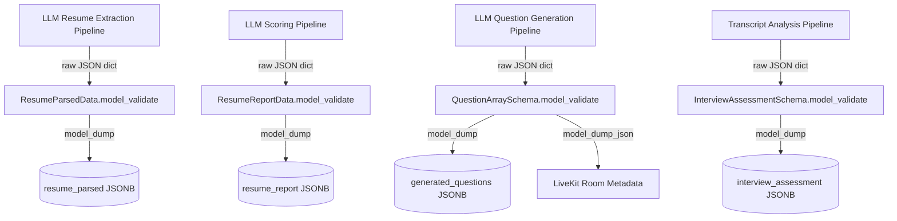

# Design Document: Phase 2 — FastAPI Data Contracts & Pydantic Validation Models

## Overview

This phase introduces the `schemas/` Python package — a pure data-contract layer with zero runtime side effects. It contains three modules (`resume.py`, `questions.py`, `assessment.py`) plus an `__init__.py` that re-exports the four top-level models consumed by all downstream phases. No HTTP routes, database connections, or background tasks are implemented here. The sole responsibility of this layer is to define, validate, and serialize the structured JSON payloads that flow between the LLM pipelines, the PostgreSQL JSONB columns, and the LiveKit Room Metadata.

---

## Architecture

The `schemas/` package sits at the boundary between raw LLM output and the rest of the system. Every pipeline that produces or consumes structured data passes through one of these models.



The package has no inbound dependencies on FastAPI, the database client, or any LLM SDK. This keeps it independently testable and importable by any future service layer.

---

## Components and Interfaces

### Package Structure

```
schemas/
├── __init__.py          # Re-exports the 4 top-level models
├── resume.py            # ResumeParsedData, ResumeReportData + sub-models
├── questions.py         # QuestionArraySchema, GeneratedQuestionItem
└── assessment.py        # InterviewAssessmentSchema, DimensionScoreCard
```

### `schemas/__init__.py`

Provides a single import surface for all downstream consumers:

```python
from schemas.resume import ResumeParsedData, ResumeReportData
from schemas.questions import QuestionArraySchema
from schemas.assessment import InterviewAssessmentSchema

__all__ = [
    "ResumeParsedData",
    "ResumeReportData",
    "QuestionArraySchema",
    "InterviewAssessmentSchema",
]
```

### `schemas/resume.py`

Four sub-models compose into two top-level models:

| Model | Role | Target JSONB Column |
|---|---|---|
| `PersonalInfo` | Contact details sub-model | — |
| `ExperienceItem` | Single work history entry | — |
| `ProjectItem` | Single project entry | — |
| `EducationItem` | Single education entry | — |
| `ResumeParsedData` | Full structured resume | `resume_parsed` |
| `ResumeReportData` | JD alignment score + narrative | `resume_report` |

All fields on sub-models are `Optional` with `None` defaults to tolerate incomplete LLM output gracefully. `ResumeReportData` fields are required because a scoring pipeline that produces no score is a pipeline failure, not a partial result.

### `schemas/questions.py`

| Model | Role | Target |
|---|---|---|
| `GeneratedQuestionItem` | Single question with metadata | Element of `generated_questions` array |
| `QuestionArraySchema` | Exactly-8-question wrapper | `generated_questions` JSONB + LiveKit Room Metadata |

The `category` field on `GeneratedQuestionItem` uses `Literal['opening', 'experience', 'rolefit', 'behavioral', 'situational', 'closing']` to enforce the six valid question types at parse time. The 8-item constraint on `QuestionArraySchema.questions` is enforced via Pydantic v2's `Field(min_length=8, max_length=8)` — a `ValidationError` is raised on any deviation, which the calling pipeline must handle as a retry signal to the LLM.

### `schemas/assessment.py`

| Model | Role | Target JSONB Column |
|---|---|---|
| `DimensionScoreCard` | Per-dimension evaluation | Value type in `dimension_scores` dict |
| `InterviewAssessmentSchema` | Full post-interview report | `interview_assessment` |

`dimension_scores` is typed as `Dict[str, DimensionScoreCard]` where the string key is the dimension name (e.g., `"Technical Familiarity"`, `"Communication"`). This keeps the schema open to new dimensions without requiring a model change. `completion_ratio` and `overall_score` both carry Pydantic v2 `Field(ge=..., le=...)` constraints that enforce valid ranges at instantiation time.

---

## Data Models

### Full Model Reference

```python
# schemas/resume.py

class PersonalInfo(BaseModel):
    name: Optional[str] = None
    email: Optional[EmailStr] = None
    phone: Optional[str] = None
    linkedin: Optional[str] = None
    github: Optional[str] = None
    portfolio: Optional[str] = None

class ExperienceItem(BaseModel):
    title: Optional[str] = None
    company: Optional[str] = None
    duration: Optional[str] = None
    description: Optional[str] = None

class ProjectItem(BaseModel):
    name: Optional[str] = None
    description: Optional[str] = None
    link: Optional[str] = None

class EducationItem(BaseModel):
    degree: Optional[str] = None
    school: Optional[str] = None
    year: Optional[str] = None
    grade: Optional[str] = None

class ResumeParsedData(BaseModel):
    personal_info: PersonalInfo
    summary: Optional[str] = None
    skills: List[str] = Field(default_factory=list)
    experience: List[ExperienceItem] = Field(default_factory=list)
    projects: List[ProjectItem] = Field(default_factory=list)
    education: List[EducationItem] = Field(default_factory=list)
    certifications: List[str] = Field(default_factory=list)

class ResumeReportData(BaseModel):
    score: int = Field(..., ge=0, le=100)
    reference_to_jd: str
    strengths: List[str]
    weaknesses: List[str]
```

```python
# schemas/questions.py

class GeneratedQuestionItem(BaseModel):
    id: int
    question: str
    category: Literal['opening', 'experience', 'rolefit', 'behavioral', 'situational', 'closing']
    expected_duration_seconds: int = 120

class QuestionArraySchema(BaseModel):
    questions: List[GeneratedQuestionItem] = Field(..., min_length=8, max_length=8)
```

```python
# schemas/assessment.py

class DimensionScoreCard(BaseModel):
    score: int = Field(..., ge=0, le=100)
    max_score: int = 100
    label: str
    verdict: str
    evidence: str
    strengths: List[str] = Field(default_factory=list)
    gaps: List[str] = Field(default_factory=list)

class InterviewAssessmentSchema(BaseModel):
    overall_score: int = Field(..., ge=0, le=100)
    practice_verdict: str
    summary: str
    dimension_scores: Dict[str, DimensionScoreCard]
    overall_strengths: List[str]
    overall_gaps: List[str]
    technical_round_probes: List[str] = Field(default_factory=list)
    turns_analyzed: int
    completion_ratio: float = Field(..., ge=0.0, le=1.0)
```

### JSONB Compatibility

All models use only JSON-native Python types (`str`, `int`, `float`, `bool`, `list`, `dict`, `None`). `EmailStr` serializes to a plain string via `model_dump()`. No `datetime`, `UUID`, or custom types are present in these schemas, so `model_dump()` output is directly passable to `asyncpg`'s `json.dumps` or the Supabase Python client's JSONB insert without any additional serialization step.

---

## Error Handling

| Scenario | Behavior |
|---|---|
| LLM returns fewer than 8 questions | `QuestionArraySchema.model_validate(data)` raises `ValidationError`. The calling pipeline catches this and retries the LLM call. |
| LLM returns an invalid `category` string | `ValidationError` raised on `GeneratedQuestionItem`. Same retry path. |
| `overall_score` or `completion_ratio` out of bounds | `ValidationError` raised on `InterviewAssessmentSchema`. The assessment pipeline must clamp or re-request. |
| `ResumeReportData.score` out of 0–100 range | `ValidationError` raised. Scoring pipeline must handle. |
| Optional sub-model fields missing from LLM output | `None` defaults absorb missing fields gracefully — no error raised. |

The schemas themselves do not catch or log errors. Error handling is the responsibility of the pipeline layer (Phase 3+) that calls `model_validate()`. This keeps the schema layer pure and side-effect free.

---

## Testing Strategy

Validation is confirmed via Python's import and schema export mechanism rather than a full test suite at this phase. The canonical verification command from the phase spec is:

```bash
python3 -c "from schemas.resume import ResumeParsedData; print(ResumeParsedData.model_json_schema())"
```

Equivalent checks for the other three top-level models confirm structural integrity. A minimal smoke-test script (`schemas/smoke_test.py`) can be included to instantiate each model with valid fixture data and assert `model_dump()` returns a dict — this covers the JSONB compatibility requirement without requiring a test framework.

Full unit tests (boundary conditions, invalid input rejection) are deferred to Phase 3 when the schemas are exercised by real pipeline logic, making test coverage more meaningful.
