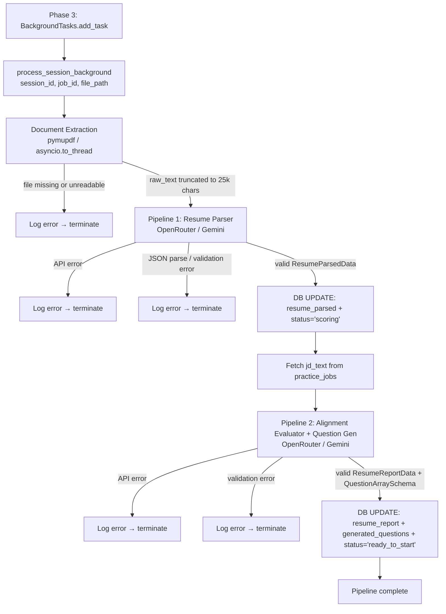

# Design Document: Phase 4 — Async Extractor, Matcher & Question Generation Pipeline

## Overview

Phase 4 wires up the background processing engine that transforms a raw PDF resume and a Job Description text into a fully-prepared interview session. The pipeline runs entirely inside FastAPI's native `BackgroundTasks` — it is never awaited by the HTTP handler and never blocks a response. Three sequential stages execute after Phase 3's `201 Created` is returned:

1. **Document Extraction** — PyMuPDF reads the stored PDF and produces a sanitized raw text string.
2. **Pipeline 1: Resume Parser** — Gemini (via OpenRouter) converts the raw text into a structured `ResumeParsedData` JSON object; session status advances to `'scoring'`.
3. **Pipeline 2: Alignment Evaluator + Question Generator** — Gemini (via OpenRouter) scores the resume against the JD and generates exactly 8 personalized questions; session status advances to `'ready_to_start'`.

All intermediate and final results are committed back to `practice_sessions` at each milestone. Failures at any stage are caught, logged, and silently terminated — the FastAPI worker process is never crashed.

---

## Architecture



### Status Transition Map

```
practice_sessions.status
  'parsing'  ──► (Pipeline 1 success) ──► 'scoring'  ──► (Pipeline 2 success) ──► 'ready_to_start'
                                                      └── (Pipeline 2 failure) ──► stays 'scoring'
               └── (Pipeline 1 failure) ──► stays 'parsing'
```

---

## Components and Interfaces

### New Files

```
api/
└── llm_client.py          # Async OpenRouter HTTP client (centralized)
services/
└── background_pipeline.py # process_session_background + stage functions
scripts/
└── verify_phase4.py       # Mock-based verification script
```

### Modified Files

```
api/routers/practice.py    # Import + register process_session_background
config.py                  # Add OPENROUTER_API_KEY, OPENROUTER_MODEL settings
```

---

### `api/llm_client.py` — OpenRouter Async Client

Centralizes all OpenRouter communication. Exposes a single async function used by both pipeline stages.

```python
import httpx
from config import settings

OPENROUTER_BASE_URL = "https://openrouter.ai/api/v1/chat/completions"

async def call_openrouter(system_prompt: str, user_content: str) -> str:
    """
    Sends a chat completion request to OpenRouter.
    Returns the raw content string from the first choice.
    Raises httpx.HTTPStatusError on non-200 responses.
    """
    headers = {
        "Authorization": f"Bearer {settings.OPENROUTER_API_KEY}",
        "Content-Type": "application/json",
    }
    payload = {
        "model": settings.OPENROUTER_MODEL,
        "messages": [
            {"role": "system", "content": system_prompt},
            {"role": "user", "content": user_content},
        ],
        "response_format": {"type": "json_object"},
    }
    async with httpx.AsyncClient(timeout=120.0) as client:
        response = await client.post(OPENROUTER_BASE_URL, json=payload, headers=headers)
        response.raise_for_status()
        return response.json()["choices"][0]["message"]["content"]
```

Key decisions:
- `response_format: json_object` forces Gemini to return valid JSON, eliminating markdown fence stripping.
- 120-second timeout accommodates the larger Pipeline 2 prompt without hanging indefinitely.
- `raise_for_status()` surfaces non-200 codes as `httpx.HTTPStatusError`, which the pipeline catches and logs.

---

### `services/background_pipeline.py` — Pipeline Orchestrator

The single module that owns all three processing stages. Imported by `api/routers/practice.py` for `BackgroundTasks` registration.

#### Entry Point

```python
async def process_session_background(
    session_id: str,
    job_id: str,
    file_path: str,
    db_pool,          # asyncpg Pool passed from app.state
) -> None:
```

The `db_pool` is passed explicitly rather than using a FastAPI `Depends` injection (which is not available outside request scope). The practice router passes `request.app.state.db_pool` when registering the task.

#### Stage 1: Document Extraction

```python
import asyncio
import fitz  # pymupdf

async def extract_resume_text(file_path: str) -> str:
    def _extract():
        doc = fitz.open(file_path)
        text = "".join(page.get_text() for page in doc)
        doc.close()
        return text[:25000]
    return await asyncio.to_thread(_extract)
```

`fitz.open` is synchronous and CPU-bound; `asyncio.to_thread` offloads it to a thread pool executor, keeping the event loop free.

#### Stage 2: Pipeline 1 — Resume Parser

System prompt instructs Gemini to return a JSON object matching `ResumeParsedData`. The prompt explicitly lists all required keys and instructs the model to use empty arrays for missing sections (e.g., no certifications).

```python
async def run_pipeline_1(raw_text: str) -> ResumeParsedData:
    system_prompt = build_resume_parser_prompt()
    raw_json = await call_openrouter(system_prompt, raw_text)
    return ResumeParsedData.model_validate_json(raw_json)
```

#### Stage 3: Pipeline 2 — Alignment Evaluator + Question Generator

The system prompt is the most complex in the project. It receives two inputs: the serialized `ResumeParsedData` JSON and the raw `jd_text`. It instructs Gemini to return a single JSON object with two top-level keys: `"resume_report"` and `"questions"`.

```python
async def run_pipeline_2(
    parsed_resume: ResumeParsedData,
    jd_text: str,
) -> tuple[ResumeReportData, QuestionArraySchema]:
    system_prompt = build_pipeline_2_prompt()
    user_content = json.dumps({
        "resume": parsed_resume.model_dump(),
        "jd_text": jd_text,
    })
    raw_json = await call_openrouter(system_prompt, user_content)
    data = json.loads(raw_json)
    report = ResumeReportData.model_validate(data["resume_report"])
    questions = QuestionArraySchema.model_validate({"questions": data["questions"]})
    return report, questions
```

---

### Prompt Design

#### Pipeline 1 System Prompt (`build_resume_parser_prompt`)

```
You are a resume parsing engine. Extract structured data from the provided resume text.
Return ONLY a valid JSON object with this exact structure:
{
  "personal_info": { "name", "email", "phone", "linkedin", "github", "portfolio" },
  "summary": "...",
  "skills": [...],
  "experience": [{ "title", "company", "duration", "description" }],
  "projects": [{ "name", "description", "link" }],
  "education": [{ "degree", "school", "year", "grade" }],
  "certifications": [...]
}
Use null for missing string fields. Use empty arrays [] for missing list fields. Do not add extra keys.
```

#### Pipeline 2 System Prompt (`build_pipeline_2_prompt`)

The prompt enforces all content rules from the requirements:

```
You are an expert technical interviewer and resume analyst.
You will receive a JSON object with two keys: "resume" (parsed resume data) and "jd_text" (job description).

Return ONLY a valid JSON object with exactly two top-level keys: "resume_report" and "questions".

"resume_report" must match:
{
  "score": <integer 0-100>,
  "reference_to_jd": "<one paragraph summary of alignment>",
  "strengths": ["...", ...],
  "weaknesses": ["...", ...]
}

"questions" must be an array of exactly 8 objects, each with:
{
  "id": <1-8>,
  "question": "...",
  "category": <one of: "opening","experience","rolefit","behavioral","situational","closing">,
  "expected_duration_seconds": <120 or 150>
}

QUESTION RULES:
- Q1: Warm introduction and high-level background sweep. Category: "opening".
- Q2-Q3: Resume-specific deep dives referencing actual projects, stack transitions, or tool selections. Category: "experience".
- Q4-Q6: Role alignment, work style, or situational context relative to the JD. Category: "rolefit" or "situational".
- Q7: Professional growth patterns and transition motivations. Category: "behavioral".
- Q8: Formal closing and personal reflection. Category: "closing".
- At least 4 questions MUST name specific tools, repositories, or employers found in the resume.
- Tone: conversational and informal. Use openers like "So," or "I noticed".
- BANNED WORDS: spearheaded, honed, leveraged, cross-functional, stakeholders, robust, deep dive.
- BANNED QUESTION TYPES: conceptual definitions, language trivia, direct coding queries (e.g. "Explain the event loop").
- Every question must prompt the candidate to narrate actual past scenarios, tools used, or projects built.
```

---

## Data Models

All models are already defined in Phase 2 schemas. Phase 4 only consumes them.

| Schema | File | Used In |
|---|---|---|
| `ResumeParsedData` | `schemas/resume.py` | Pipeline 1 output → `resume_parsed` column |
| `ResumeReportData` | `schemas/resume.py` | Pipeline 2 output → `resume_report` column |
| `GeneratedQuestionItem` | `schemas/questions.py` | Pipeline 2 output (per item) |
| `QuestionArraySchema` | `schemas/questions.py` | Pipeline 2 output → `generated_questions` column |

### Database Column Updates

All writes target `practice_sessions`. No new columns are introduced; all JSONB columns were defined in Phase 1.

#### After Pipeline 1

```sql
UPDATE practice_sessions
SET resume_parsed = $1, status = 'scoring'
WHERE id = $2;
```

#### After Pipeline 2

```sql
UPDATE practice_sessions
SET resume_report = $1,
    generated_questions = $2,
    status = 'ready_to_start'
WHERE id = $3;
```

---

## Configuration

Two new settings are added to `config.py`:

| Setting | Environment Variable | Default |
|---|---|---|
| `OPENROUTER_API_KEY` | `OPENROUTER_API_KEY` | (required, no default) |
| `OPENROUTER_MODEL` | `OPENROUTER_MODEL` | `"google/gemini-flash-1.5"` |

The API key has no default and will raise a `ValidationError` at startup if not set, preventing silent failures at runtime.

---

## Error Handling

| Stage | Failure Condition | Behavior | Final `status` |
|---|---|---|---|
| Document Extraction | File not found / PyMuPDF error | Log + terminate | `'parsing'` |
| Pipeline 1 API call | Network error / non-200 / timeout | Log + terminate | `'parsing'` |
| Pipeline 1 validation | Invalid JSON / schema mismatch | Log + terminate | `'parsing'` |
| DB UPDATE after P1 | asyncpg error | Log + terminate | `'parsing'` |
| JD text fetch | asyncpg error | Log + terminate | `'scoring'` |
| Pipeline 2 API call | Network error / non-200 / timeout | Log + terminate | `'scoring'` |
| Pipeline 2 validation | Invalid JSON / schema mismatch | Log + terminate | `'scoring'` |
| DB UPDATE after P2 | asyncpg error | Log + terminate | `'scoring'` |

All exceptions are caught at the top-level `try/except` in `process_session_background`. The FastAPI worker process is never crashed. Errors are logged with `session_id` for traceability.

---

## Testing Strategy

### Verification Script (`scripts/verify_phase4.py`)

The script creates a fresh test session in the database (status `'parsing'`), then calls `process_session_background` directly with mocked OpenRouter responses using `unittest.mock.patch`. It verifies:

1. `practice_sessions.status` transitions: `'parsing'` → `'scoring'` → `'ready_to_start'`.
2. `resume_parsed` is a valid `ResumeParsedData` JSON string.
3. `resume_report` is a valid `ResumeReportData` JSON string with `score` in [0, 100].
4. `generated_questions` is a valid `QuestionArraySchema` JSON string with exactly 8 items.
5. No unhandled exception is raised.

### Unit Tests (Optional)

If written, unit tests should use `pytest-asyncio` and `unittest.mock.AsyncMock` to mock `call_openrouter` and the `asyncpg` pool. Tests should cover:

- Successful end-to-end pipeline execution with fixture data.
- Pipeline termination on API failure (Pipeline 1 and Pipeline 2 independently).
- Pipeline termination on schema validation failure.
- Text truncation at exactly 25,000 characters.
- Empty `certifications` list handled without validation error.
