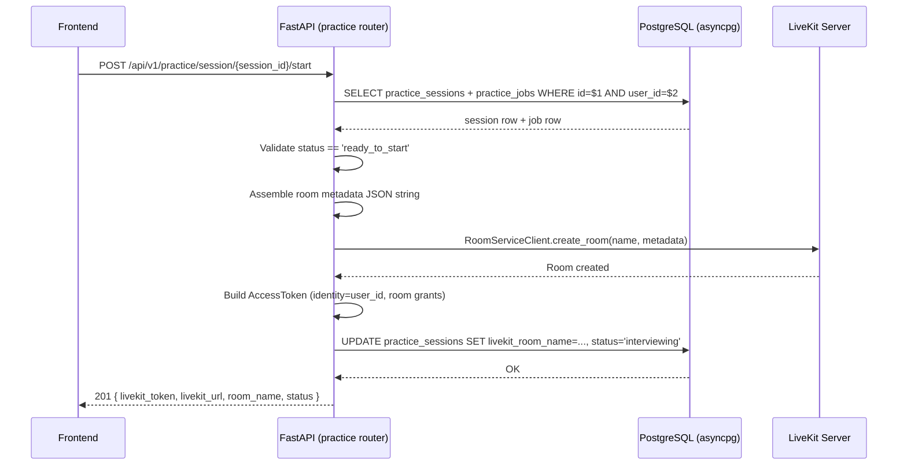

# Design Document: Phase 6 — LiveKit Room Initialization & Metadata Injection

## Overview

This phase adds a single `POST /api/v1/practice/session/{session_id}/start` endpoint to the existing `practice` router. When called, it validates the session is in `ready_to_start` state, assembles the full agent blueprint as a JSON metadata string, provisions a LiveKit room with that metadata, generates a signed JWT access token for the candidate, advances the session status to `interviewing`, and returns the connection details to the frontend.

No new services or background tasks are introduced. The endpoint is synchronous from the HTTP perspective — all LiveKit SDK calls are awaited inline using `asyncio.to_thread` since the `livekit-api` SDK uses blocking I/O.

---

## Architecture



---

## Components and Interfaces

### 1. New Pydantic Schemas (`schemas/livekit.py`)

Two new models are added to keep the router clean:

```python
class RoomMetadataPayload(BaseModel):
    """Serialized as a JSON string and injected into the LiveKit room."""
    interview_id: str
    user_id: str
    candidate_name: str
    job_title: str
    questions: list[dict]
    resume_summary: dict
    jd_summary: str
    agent_name: str = "Aria"
    agent_voice: str = "simran"
    agent_language: str = "English"
    agent_gender: str = "F"


class StartSessionResponse(BaseModel):
    livekit_token: str
    livekit_url: str
    room_name: str
    status: str
```

### 2. Config Extension (`config.py`)

Three new fields are added to the existing `Settings` class:

```python
LIVEKIT_API_URL: str = "http://localhost:7880"
LIVEKIT_API_KEY: str          # required — raises ValidationError if absent
LIVEKIT_API_SECRET: str       # required — raises ValidationError if absent
```

`LIVEKIT_API_KEY` and `LIVEKIT_API_SECRET` have no default, so `pydantic-settings` will raise a `ValidationError` at startup if they are missing from the environment.

### 3. LiveKit Helper (`api/livekit_helper.py`)

A thin module that wraps the blocking `livekit-api` SDK calls and exposes two async functions:

```python
async def provision_room(room_name: str, metadata: str) -> None:
    """Create (or join) a LiveKit room with the given metadata string."""

async def generate_token(room_name: str, identity: str) -> str:
    """Return a signed JWT granting room_join, can_publish, can_subscribe."""
```

Both functions run the synchronous SDK calls inside `asyncio.to_thread` to avoid blocking the event loop, consistent with the pattern used in `services/background_pipeline.py` for PyMuPDF.

**Rationale**: Isolating LiveKit SDK calls in a helper module keeps the router thin, makes the helper independently testable, and avoids importing `livekit` SDK internals directly into the router.

### 4. Start Endpoint (`api/routers/practice.py`)

A new route is appended to the existing `practice` router:

```
POST /api/v1/practice/session/{session_id}/start
```

**Handler logic (in order):**

1. Fetch the `practice_sessions` row joined with `practice_jobs` for the given `session_id` and `user_id`.
2. Return 404 if not found.
3. Return 400 if `status` is not `ready_to_start` (with a status-specific message).
4. Build `RoomMetadataPayload` from DB columns and serialize to JSON string.
5. Call `provision_room(room_name, metadata_str)` — return 503 on LiveKit error.
6. Call `generate_token(room_name, str(user_id))` — return 503 on error.
7. `UPDATE practice_sessions SET livekit_room_name=$1, status='interviewing' WHERE id=$2`.
8. Return `StartSessionResponse` with HTTP 201.

---

## Data Models

### Database — `practice_sessions` (no schema changes needed)

The `livekit_room_name VARCHAR(255)` column already exists from Phase 1. The `status` column already supports `'interviewing'`. No migrations are required.

### Room Metadata JSON Structure

This is the exact payload the LiveKit voice agent worker expects:

```json
{
  "interview_id": "<session_id as string>",
  "user_id": "<user_id as string>",
  "candidate_name": "<users.full_name>",
  "job_title": "<practice_jobs.title>",
  "questions": [
    {
      "id": 1,
      "question": "...",
      "category": "opening",
      "expected_duration_seconds": 120
    }
  ],
  "resume_summary": { /* resume_report JSONB dict */ },
  "jd_summary": "<practice_jobs.description>",
  "agent_name": "Aria",
  "agent_voice": "simran",
  "agent_language": "English",
  "agent_gender": "F"
}
```

**Field sourcing:**

| Metadata field    | Source                                          |
|-------------------|-------------------------------------------------|
| `interview_id`    | `practice_sessions.id`                          |
| `user_id`         | `practice_sessions.user_id`                     |
| `candidate_name`  | `users.full_name` (joined via `user_id`)        |
| `job_title`       | `practice_jobs.title`                           |
| `questions`       | `practice_sessions.generated_questions` (JSONB) |
| `resume_summary`  | `practice_sessions.resume_report` (JSONB)       |
| `jd_summary`      | `practice_jobs.description`                     |
| `agent_*`         | Fixed constants                                 |

The DB query for the start endpoint must join `practice_sessions`, `practice_jobs`, and `users` in a single fetch to populate all fields.

### API Response Schema

```json
{
  "livekit_token": "<signed JWT string>",
  "livekit_url": "ws://localhost:7880",
  "room_name": "practice-room-<session_id>",
  "status": "interviewing"
}
```

---

## Error Handling

| Condition | HTTP Status | Response detail |
|---|---|---|
| Session not found or wrong user | 404 | `"Session not found."` |
| Status is `parsing` or `scoring` | 400 | `"Session is still processing. Please wait."` |
| Status is `interviewing` | 400 | `"Session has already been started."` |
| Status is `completed` | 400 | `"Session has already been completed."` |
| LiveKit room creation fails | 503 | `"LiveKit room provisioning failed."` |
| LiveKit token generation fails | 503 | `"LiveKit token generation failed."` |
| Database update fails | 500 | `"Database error updating session."` |

All errors are raised as `HTTPException` instances, consistent with the existing router pattern.

---

## Testing Strategy

A verification script `scripts/verify_phase6.py` will:

1. Call `POST /api/v1/practice/session/{session_id}/start` on a known `ready_to_start` session.
2. Assert the response is HTTP 201 and contains `livekit_token`, `livekit_url`, `room_name`, `status`.
3. Decode the JWT (without verification) and assert the payload contains the correct `room` and `sub` (identity) claims.
4. Assert the DB row now has `status='interviewing'` and `livekit_room_name='practice-room-{session_id}'`.
5. Call the same endpoint again and assert HTTP 400 is returned (idempotency guard).

Unit tests in `tests/test_phase6_start.py` will cover:
- `RoomMetadataPayload` serialization correctness.
- Status validation logic (all invalid status branches).
- Token claim structure via the helper function directly.
