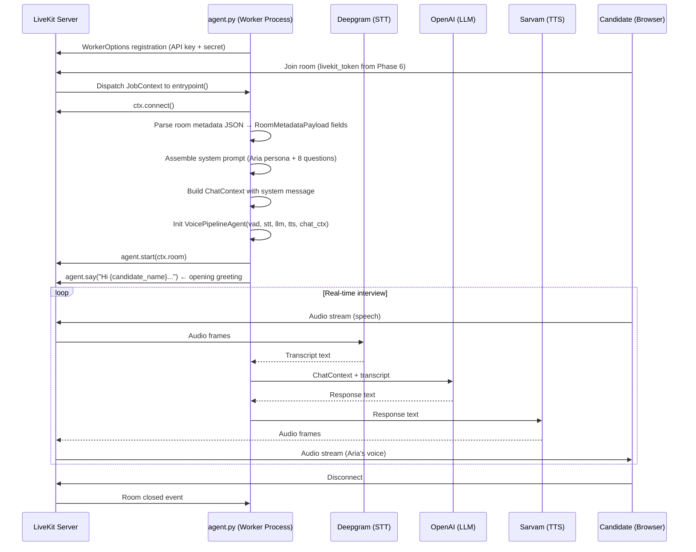

# Design Document: Phase 7 — LiveKit Python Voice Agent Worker

## Overview

Phase 7 introduces `agent.py` — a standalone Python process that runs alongside the FastAPI server. It registers with the LiveKit server as a named worker, claims incoming room sessions, reads the structured interview blueprint from the room metadata (injected by the Phase 6 `/start` endpoint), assembles a dynamic system prompt for the AI persona "Aria", and drives a full real-time voice pipeline using Deepgram STT, OpenAI LLM, and Sarvam TTS.

This is a **separate process** from the FastAPI app. It is not imported by `main.py` and has no HTTP surface. It is started independently via:

```
.venv/Scripts/python agent.py start --dev
```

The agent reads the same `.env` file as the FastAPI app, plus three additional keys: `OPENAI_API_KEY`, `DEEPGRAM_API_KEY`, and `SARVAM_API_KEY`.

---

## Architecture



---

## Components and Interfaces

### 1. New File: `agent.py` (project root)

The single entry point for the worker process. Contains two functions and the `cli.run_app` bootstrap.

```
agent.py
├── entrypoint(ctx: JobContext)       ← @server.rtc_session decorated
├── start_mock_interview(ctx, meta)   ← pipeline assembly + greeting
└── cli.run_app(WorkerOptions(...))   ← process bootstrap (if __name__ == "__main__")
```

**Design decision**: Keeping both functions in a single file (rather than splitting into `agent/` package) matches the LiveKit Agents SDK convention and keeps the worker self-contained. The file is small enough that a package split adds no value.

### 2. Config Extension (`config.py`)

Three new optional fields are added to the existing `Settings` class for the agent's AI provider credentials:

```python
OPENAI_API_KEY: str        # required by livekit-agents openai plugin
DEEPGRAM_API_KEY: str      # required by livekit-agents deepgram plugin
SARVAM_API_KEY: str        # required by livekit-agents sarvam plugin
LIVEKIT_URL: str           # WebSocket URL for agent worker (wss://...)
```

`LIVEKIT_API_URL` (already present) is the HTTP REST URL used by the FastAPI helper. `LIVEKIT_URL` is the WebSocket URL used by the agent worker SDK — these are different values and both must be present.

**Rationale**: Centralizing all config in `config.py` / `Settings` ensures a single source of truth and consistent validation at startup. The agent imports `settings` directly rather than reading `os.environ` inline.

### 3. New Dependencies

The following packages must be added to the project's Python environment:

| Package | Purpose |
|---|---|
| `livekit-agents[openai,deepgram,sarvam,silero]` | Core agent SDK + all required plugins |
| `openai` | OpenAI API client (pulled in by the openai plugin) |

**Installation command** (to be run manually in the `.venv`):
```
.venv\Scripts\pip install "livekit-agents[openai,deepgram,sarvam,silero]"
```

The `silero` extra provides the VAD (Voice Activity Detection) model used by `VoicePipelineAgent`.

### 4. `entrypoint` Function

```python
@server.rtc_session(agent_name="practice-interview-agent")
async def entrypoint(ctx: JobContext):
    await ctx.connect()

    room_metadata_str = ctx.room.metadata
    if not room_metadata_str:
        logger.error("Missing room metadata — session_id unknown. Terminating.")
        return

    try:
        metadata = json.loads(room_metadata_str)
    except json.JSONDecodeError as exc:
        logger.error("Malformed room metadata JSON: %s", exc)
        return

    await start_mock_interview(ctx, metadata)
```

**Error handling**: Both the missing-metadata and malformed-JSON paths log a structured error and return cleanly. The worker process itself is not terminated — it remains registered and available for the next room event.

### 5. `start_mock_interview` Function

Responsible for:
1. Extracting fields from the metadata dict.
2. Building the system prompt string.
3. Constructing `ChatContext` with the system message.
4. Initializing and starting `VoicePipelineAgent`.
5. Sending the opening greeting.

```python
async def start_mock_interview(ctx: JobContext, metadata: dict):
    candidate_name = metadata.get("candidate_name", "there")
    job_title      = metadata.get("job_title", "the role")
    resume_summary = metadata.get("resume_summary", {})
    questions      = metadata.get("questions", [])
    jd_summary     = metadata.get("jd_summary", "")

    system_prompt = _build_system_prompt(
        candidate_name, job_title, resume_summary, questions, jd_summary
    )

    initial_ctx = ChatContext().append(role="system", text=system_prompt)

    agent = VoicePipelineAgent(
        vad=silero.VAD.load(),
        stt=deepgram.STT(model="nova-3"),
        llm=openai.LLM(model="gpt-4o-mini"),
        tts=sarvam.TTS(voice="simran"),
        chat_ctx=initial_ctx,
    )

    agent.start(ctx.room)

    await agent.say(
        f"Hi {candidate_name}, I'm Aria. I'll be your practice interviewer today. "
        f"We're going to run through a mock interview for the {job_title} role. "
        "Whenever you're ready, let's get started."
    )
```

### 6. `_build_system_prompt` Helper

A pure function (no I/O) that formats the system prompt string. Keeping it separate makes it independently testable.

```python
def _build_system_prompt(
    candidate_name: str,
    job_title: str,
    resume_summary: dict,
    questions: list,
    jd_summary: str,
) -> str:
```

The prompt structure follows the Phase 7 spec exactly:

```
# Role and Core Directive
You are Aria, an empathetic, encouraging, yet professional AI interviewer...

# Candidate Profile
- Name: {candidate_name}
- Target Role: {job_title}
- Background Summary: {resume_summary}

# Fixed Interview Roadmap
1. {Q1}
2. {Q2}
...
8. {Q8}

# Interaction Constraints
- Deliver your opening greeting question immediately...
- Follow-up rules...
- Banned words: spearheaded, honed, leveraged, cross-functional, robust, deep dive
```

### 7. Worker Bootstrap

```python
if __name__ == "__main__":
    cli.run_app(
        WorkerOptions(
            entrypoint_fnc=entrypoint,
            api_key=settings.LIVEKIT_API_KEY,
            api_secret=settings.LIVEKIT_API_SECRET,
            ws_url=settings.LIVEKIT_URL,
        )
    )
```

`cli.run_app` handles the `start --dev` argument parsing, signal handling, and reconnection logic provided by the LiveKit Agents SDK.

---

## Data Models

### Room Metadata (consumed, not produced)

The agent reads the `RoomMetadataPayload` structure that was injected by the Phase 6 `/start` endpoint. No new Pydantic models are introduced in Phase 7 — the agent accesses the metadata as a plain `dict` after `json.loads()` to avoid a circular import between `agent.py` and `schemas/`.

| Field | Type | Used in |
|---|---|---|
| `candidate_name` | `str` | System prompt, opening greeting |
| `job_title` | `str` | System prompt, opening greeting |
| `resume_summary` | `dict` | System prompt background section |
| `questions` | `list[dict]` | System prompt roadmap (8 items) |
| `jd_summary` | `str` | System prompt context (optional) |
| `agent_voice` | `str` | TTS voice selection (future use) |

### Config Fields (new additions to `config.py`)

| Field | Source | Required |
|---|---|---|
| `LIVEKIT_URL` | `.env` | Yes — agent WebSocket URL |
| `OPENAI_API_KEY` | `.env` | Yes — LLM plugin |
| `DEEPGRAM_API_KEY` | `.env` | Yes — STT plugin |
| `SARVAM_API_KEY` | `.env` | Yes — TTS plugin |

---

## Error Handling

| Condition | Behavior |
|---|---|
| `ctx.room.metadata` is empty/null | Log error, return from entrypoint, worker stays alive |
| Room metadata JSON is malformed | Log error with exception detail, return from entrypoint |
| Required metadata field is missing | Use safe `.get()` defaults, log a warning, continue |
| `VoicePipelineAgent.start()` raises | Exception propagates to LiveKit SDK, which logs and closes the job |
| Required env var missing at startup | `pydantic-settings` raises `ValidationError` before any connection attempt |
| LiveKit server unreachable on startup | SDK raises connection error, process exits with non-zero code |

**Design decision**: The entrypoint function catches only the two predictable failure modes (missing metadata, malformed JSON) and handles them gracefully. All other exceptions are intentionally left unhandled so the LiveKit SDK's built-in job error handling can log and report them correctly.

---

## Testing Strategy

A verification script `scripts/verify_phase7.py` will:

1. Import `agent._build_system_prompt` and assert the output contains the candidate name, job title, and all 8 question strings.
2. Assert the system prompt does not contain any banned buzzwords.
3. Import `agent.entrypoint` and confirm it is a coroutine function (basic import smoke test).

Unit tests in `tests/test_agent.py` will cover:
- `_build_system_prompt` output structure with a fixture metadata dict.
- Graceful handling of empty `questions` list in the prompt builder.
- Config validation: assert `Settings` raises on missing `OPENAI_API_KEY`.

**Note**: Full end-to-end testing of the voice pipeline requires a running LiveKit server and valid API credentials. The verification script covers the structural and configuration layer only. Live pipeline testing is done manually via `python agent.py start --dev`.
