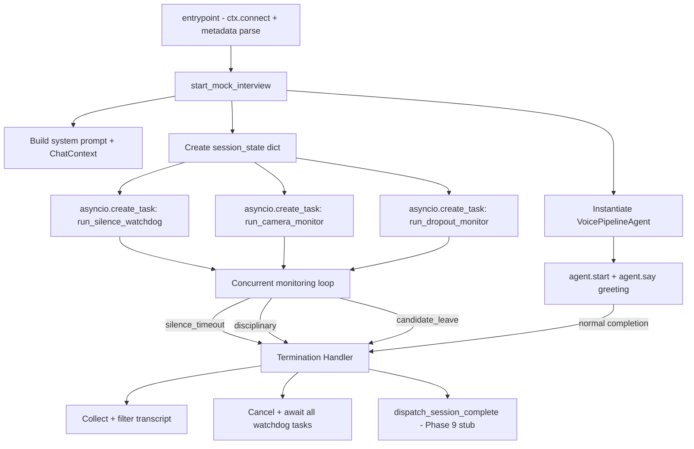

# Design Document — Phase 8: Real-Time Session Watchdogs & Interactive Guardrails

## Overview

Phase 8 adds three concurrent `asyncio` background tasks to the existing `agent.py` voice worker. These tasks run alongside the active `VoicePipelineAgent` interview loop and enforce behavioral guardrails: silence detection, camera integrity monitoring, and network dropout recovery. All three tasks share a single `session_state` dictionary and are guaranteed to be cancelled and awaited in a `finally` block when the session ends for any reason.

The output of this phase is a clean `end_reason` string and a compiled transcript array that are handed off to the Phase 9 webhook dispatcher.

---

## Architecture



---

## Components and Interfaces

### 1. `session_state` Dictionary

Shared mutable state passed by reference to all watchdog coroutines. Defined once in `start_mock_interview`.

```python
session_state = {
    "last_candidate_speech_time": float,   # asyncio loop time of last STT utterance
    "camera_mute_count": int,              # cumulative mute events this session
    "is_camera_active": bool,              # current camera state
    "silence_paused": bool,                # True when camera/dropout monitor pauses silence timer
    "end_reason": str,                     # set by whichever component terminates first
}
```

### 2. `run_silence_watchdog(agent, ctx, session_state, candidate_name)`

Coroutine running in a `create_task`. Polls every 5 seconds.

State machine:
- `MONITORING` → elapsed ≥ 60s → deliver warning → enter `GRACE_WINDOW`
- `GRACE_WINDOW` → candidate speaks → back to `MONITORING`
- `GRACE_WINDOW` → 30s expires → deliver closing → `ctx.room.disconnect()` → set `end_reason = "silence_timeout"`

The STT utterance hook updates `session_state["last_candidate_speech_time"]` via a `@agent.on("user_speech_committed")` event listener registered in `start_mock_interview`.

Silence elapsed time is only advanced when `session_state["silence_paused"]` is `False`.

### 3. `run_camera_monitor(agent, ctx, session_state, candidate_name)`

Coroutine running in a `create_task`. Registers event listeners on `ctx.room` for `track_muted` / `track_unmuted` events, filtering for the candidate's video track.

On `track_muted`:
1. `agent.interrupt()`
2. `session_state["silence_paused"] = True`
3. `session_state["camera_mute_count"] += 1`
4. Check cumulative count — if ≥ 5, terminate immediately with `end_reason = "disciplinary"`
5. Otherwise run the escalation sequence:
   - Wait 15s → Warning 1
   - Wait 20s → Warning 2
   - Wait 5s → Warning 3 → if still muted → terminate with `end_reason = "disciplinary"`

On `track_unmuted`:
1. `session_state["is_camera_active"] = True`
2. `session_state["silence_paused"] = False`
3. Cancel the current escalation countdown

### 4. `run_dropout_monitor(agent, ctx, session_state)`

Coroutine running in a `create_task`. Subscribes to room connection quality events.

On `QUALITY_LOST` or participant disconnect:
1. `session_state["silence_paused"] = True`
2. Wait up to 60 seconds for reconnection
3. On reconnect: `session_state["silence_paused"] = False`
4. On timeout: terminate with `end_reason = "candidate_leave"`

### 5. `_collect_transcript(chat_ctx)`

Pure helper function. Iterates `chat_ctx.messages`, filters out `role == "system"`, and returns a list of dicts:

```python
[
    {
        "speaker": "agent" | "candidate",
        "text": str,
        "created_at": float  # unix timestamp
    }
]
```

### 6. `dispatch_session_complete(session_id, end_reason, transcript)` *(Phase 9 stub)*

Placeholder async function in `agent.py` that will be fully implemented in Phase 9. In Phase 8 it is defined but logs a warning and returns without making an HTTP call. This keeps the agent runnable end-to-end without Phase 9 being complete.

---

## Data Models

No new Pydantic schemas are introduced in this phase. The `session_state` dict is an internal runtime structure. The transcript array shape matches the Phase 9 webhook payload defined in `implementation/phase9.md`:

```python
# Each transcript turn
{
    "speaker": "agent" | "candidate",
    "text": str,
    "created_at": float
}
```

The `end_reason` string is one of: `"normal"`, `"silence_timeout"`, `"disciplinary"`, `"candidate_leave"`.

---

## Error Handling

| Scenario | Handling |
|---|---|
| Watchdog task raises unexpected exception | Caught inside the task coroutine, logged with `logger.error`, task exits cleanly without crashing the agent process |
| `agent.interrupt()` raises when no speech is active | Wrapped in `try/except` and silently ignored |
| `ctx.room.disconnect()` raises | Logged and swallowed; session termination proceeds regardless |
| `asyncio.CancelledError` in watchdog | Re-raised immediately (standard asyncio contract) — not logged as an error |
| Multiple watchdogs attempt to terminate simultaneously | `session_state["end_reason"]` is set only if currently empty (first-writer-wins); subsequent terminators detect the field is set and exit without re-triggering disconnect |
| Camera event fires for a non-video track | Filtered by checking `track.kind == "video"` before processing |

---

## File Changes

Only `agent.py` is modified. No new files are created.

```
agent.py
  ├── session_state dict (new)
  ├── run_silence_watchdog() (new coroutine)
  ├── run_camera_monitor() (new coroutine)
  ├── run_dropout_monitor() (new coroutine)
  ├── _collect_transcript() (new helper)
  ├── dispatch_session_complete() (new stub)
  └── start_mock_interview() (modified — wires tasks + finally block)
```

---

## Testing Strategy

Tests live in `tests/test_phase8_watchdogs.py` and use `unittest.mock` / `pytest-asyncio`. No real LiveKit connection is required.

- Silence watchdog: mock `session_state` time values and assert `agent.say()` is called at 60s and `ctx.room.disconnect()` is called after the grace window.
- Camera monitor: simulate `track_muted` / `track_unmuted` events and assert `agent.interrupt()` is called, escalation warnings fire at correct intervals, and `end_reason` is set to `"disciplinary"` on the 5th mute.
- Dropout monitor: simulate a disconnect event and assert timers pause, then assert termination fires after 60s without reconnect.
- `_collect_transcript`: assert system messages are filtered and speaker mapping is correct.
- Concurrent termination race: assert only the first `end_reason` is preserved when two watchdogs attempt to terminate simultaneously.
