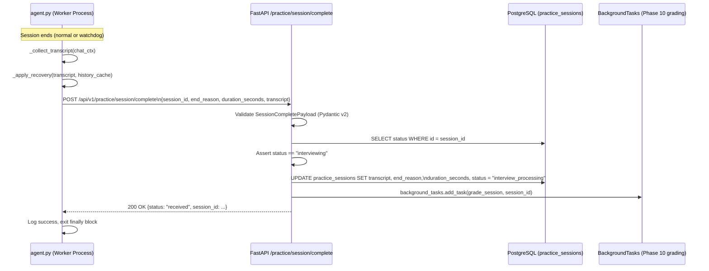

# Design Document — Phase 9: Session Handoff & Transcript Recovery Webhook

## Overview

Phase 9 closes the loop between the LiveKit voice agent worker and the FastAPI backend. When a session ends — for any reason — the agent compiles the transcript, applies a crash-recovery pass for any dropped final utterance, and fires a single synchronous HTTP POST to the backend. The backend validates the payload, writes the transcript and metadata to PostgreSQL in one atomic update, advances the session status to `interview_processing`, and immediately enqueues the Phase 10 grading pipeline via FastAPI's native `BackgroundTasks`. The agent receives a `200 OK` and exits cleanly.

Two files are modified: `agent.py` (replace the Phase 9 stub) and `api/routers/practice.py` (add the new endpoint). One new schema file is created: `schemas/session_complete.py`.

---

## Architecture



---

## Components and Interfaces

### 1. `schemas/session_complete.py` (new file)

Defines the three Pydantic v2 models that form the agent-to-backend contract.

```python
from typing import Literal
from uuid import UUID
from pydantic import BaseModel, Field

class TranscriptTurn(BaseModel):
    speaker: Literal["agent", "candidate"]
    text: str = Field(..., min_length=1)
    created_at: float
    recovered: bool = False

class SessionCompletePayload(BaseModel):
    session_id: UUID
    end_reason: Literal["normal", "silence_timeout", "disciplinary", "candidate_leave"]
    duration_seconds: int = Field(..., ge=0)
    transcript: list[TranscriptTurn] = Field(..., min_length=1)

class SessionCompleteResponse(BaseModel):
    status: str
    session_id: UUID
```

### 2. `agent.py` — replace `dispatch_session_complete` stub

The existing stub is replaced with a real implementation. The function signature is extended to accept `duration_seconds`.

#### `_apply_recovery(transcript, history_cache) -> list`

Pure helper. Checks whether the last entry in `history_cache` (the agent's internal message list) has role `"assistant"` and is absent from the compiled transcript. If so, appends a recovered turn with `recovered=True`.

```python
def _apply_recovery(transcript: list, history_cache: list) -> list:
    if not history_cache:
        return transcript
    last = history_cache[-1]
    if getattr(last, "role", None) != "assistant":
        return transcript
    last_text = _flatten_content(getattr(last, "content", ""))
    # Check if this text is already the last agent turn in the transcript
    existing_agent_texts = [t["text"] for t in transcript if t["speaker"] == "agent"]
    if existing_agent_texts and existing_agent_texts[-1] == last_text:
        return transcript
    transcript.append({
        "speaker": "agent",
        "text": last_text,
        "created_at": time.time(),
        "recovered": True,
    })
    return transcript
```

#### `dispatch_session_complete(session_id, end_reason, transcript, duration_seconds)`

Replaces the stub. Uses `httpx.AsyncClient` (already available in the venv via FastAPI's dependency chain) to POST the payload.

```python
async def dispatch_session_complete(
    session_id: str,
    end_reason: str,
    transcript: list,
    duration_seconds: int,
) -> None:
    import httpx
    from config import settings

    payload = {
        "session_id": session_id,
        "end_reason": end_reason,
        "duration_seconds": duration_seconds,
        "transcript": transcript,
    }
    url = f"{settings.BACKEND_URL}/api/v1/practice/session/complete"
    try:
        async with httpx.AsyncClient(timeout=10.0) as client:
            response = await client.post(url, json=payload)
        if response.status_code != 200:
            logger.error(
                "Webhook returned non-200: status=%d body=%s",
                response.status_code, response.text,
            )
    except Exception as exc:
        logger.error("Webhook dispatch failed: %s", exc, exc_info=True)
```

#### `start_mock_interview` — duration tracking

A `session_start_time` is captured at the top of `start_mock_interview` using `time.time()`. In the `finally` block, `duration_seconds` is computed as `int(time.time() - session_start_time)` and passed to `dispatch_session_complete`.

### 3. `api/routers/practice.py` — new endpoint

`POST /practice/session/complete` is added to the existing `practice` router.

```python
@router.post("/session/complete", response_model=SessionCompleteResponse)
async def session_complete(
    payload: SessionCompletePayload,
    background_tasks: BackgroundTasks,
    conn: asyncpg.Connection = Depends(get_db),
) -> SessionCompleteResponse:
    ...
```

Logic flow:
1. Query `practice_sessions` for the row matching `payload.session_id`.
2. Return 404 if not found.
3. Return 409 if `status != "interviewing"`.
4. Execute a single `UPDATE` setting `transcript`, `end_reason`, `duration_seconds`, `status = 'interview_processing'`.
5. On `asyncpg.PostgresError` → return 500.
6. `background_tasks.add_task(grade_session_background, str(payload.session_id), app_db_pool)`.
7. Return `SessionCompleteResponse(status="received", session_id=payload.session_id)`.

#### `grade_session_background` stub

A minimal async stub in `services/background_pipeline.py` that logs receipt and returns. Phase 10 will replace it with the real grading logic.

```python
async def grade_session_background(session_id: str, db_pool) -> None:
    logger.info("Phase 10 grading stub — session_id=%s", session_id)
```

### 4. `config.py` — new `BACKEND_URL` setting

```python
BACKEND_URL: str = "http://localhost:8000"
```

This allows the agent worker (running as a separate process) to reach the FastAPI server. The default covers local development; production overrides via `.env`.

---

## Data Models

### `TranscriptTurn`

| Field | Type | Constraints | Notes |
|---|---|---|---|
| `speaker` | `Literal["agent", "candidate"]` | required | Maps from chat context role |
| `text` | `str` | `min_length=1` | Flattened from content parts if needed |
| `created_at` | `float` | required | Unix timestamp |
| `recovered` | `bool` | default `False` | Set to `True` for crash-recovered turns |

### `SessionCompletePayload`

| Field | Type | Constraints | Notes |
|---|---|---|---|
| `session_id` | `UUID` | required | Must match a `practice_sessions` row |
| `end_reason` | `Literal[...]` | one of 4 values | Validated by Pydantic |
| `duration_seconds` | `int` | `ge=0` | Wall-clock seconds from session start |
| `transcript` | `list[TranscriptTurn]` | `min_length=1` | Empty array → 422 |

### `SessionCompleteResponse`

| Field | Type | Notes |
|---|---|---|
| `status` | `str` | Always `"received"` on success |
| `session_id` | `UUID` | Echoes back the session UUID |

### Database columns written by this phase

| Column | Type | Value written |
|---|---|---|
| `transcript` | `JSONB` | Serialized transcript array |
| `end_reason` | `VARCHAR` | One of the 4 end reason strings |
| `duration_seconds` | `INTEGER` | Wall-clock seconds |
| `status` | `VARCHAR` | `"interview_processing"` |

> Note: `end_reason` and `duration_seconds` columns must be added to `practice_sessions` via a migration if not already present. The current `init.sql` does not include them — a `ALTER TABLE` migration will be added.

---

## Error Handling

| Scenario | Component | Handling |
|---|---|---|
| Network error during POST | Agent Worker | Caught, logged at ERROR, agent exits cleanly |
| Non-2xx response from webhook | Agent Worker | Logged at ERROR, no exception raised |
| Malformed request body | Webhook Endpoint | FastAPI/Pydantic returns 422 automatically |
| Empty `transcript` array | Webhook Endpoint | Pydantic `min_length=1` constraint → 422 |
| `session_id` not found | Webhook Endpoint | Returns 404 |
| Session status ≠ `"interviewing"` | Webhook Endpoint | Returns 409 |
| Database error on UPDATE | Webhook Endpoint | Returns 500, background task NOT enqueued |
| `httpx` not installed | Agent Worker | Import error surfaced at startup; `httpx` added to dependencies |

---

## File Changes Summary

```
schemas/session_complete.py          ← NEW: TranscriptTurn, SessionCompletePayload, SessionCompleteResponse
agent.py                             ← MODIFIED: replace dispatch_session_complete stub, add _apply_recovery, add duration tracking
api/routers/practice.py              ← MODIFIED: add POST /session/complete endpoint
services/background_pipeline.py      ← MODIFIED: add grade_session_background stub
config.py                            ← MODIFIED: add BACKEND_URL setting
database/init.sql                    ← MODIFIED: add end_reason + duration_seconds columns to practice_sessions
```

---

## Testing Strategy

Tests live in `tests/test_phase9_webhook.py` using `pytest-asyncio` and `unittest.mock`.

- **Schema validation**: assert `SessionCompletePayload` rejects empty transcript, invalid `end_reason`, negative `duration_seconds`.
- **Webhook 404**: mock DB returning no row → assert 404 response.
- **Webhook 409**: mock DB returning a row with `status = "ready_to_start"` → assert 409 response.
- **Webhook 422**: send payload with `transcript = []` → assert 422 response.
- **Webhook happy path**: mock DB returning `status = "interviewing"` → assert DB UPDATE is called, background task is enqueued, response is 200 with `status = "received"`.
- **`_apply_recovery`**: unit test with a history cache whose last entry is absent from the transcript → assert recovered turn is appended with `recovered=True`.
- **`dispatch_session_complete`**: mock `httpx.AsyncClient.post` to return 200 → assert no exception; mock to raise `httpx.ConnectError` → assert no exception and error is logged.
