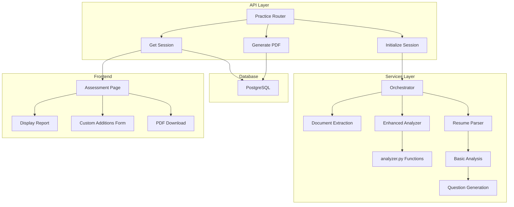

# Design Document

## Overview

This enhancement integrates the sophisticated `analyzer.py` module into the existing practice session workflow. The analyzer provides:
- Enhanced resume scoring with ATS-specific metrics
- Gap detection (missing JD requirements)
- Improvement suggestions (JD-aligned terminology)
- Custom text integration
- ATS-optimized PDF generation

The enhancement will be integrated into the pre-interview pipeline, with results displayed on the assessment page before the interview begins.

## Architecture

### Current Flow (Before Enhancement)
```
New Session → PDF Upload → Extract Text → Parse Resume → Analyze (Basic) → Generate Questions → Ready to Start
```

### Enhanced Flow
```
New Session → PDF Upload → Extract Text → Parse Resume → Enhanced Analysis → Generate Questions → Ready to Start
                                    ↓
                            (Optional: Custom Additions → Refine → Generate PDF)
```

### Component Diagram



## Components and Interfaces

### 1. Enhanced Analyzer Service (`services/enhanced_analyzer.py`)

**Purpose:** Wrap `analyzer.py` functions and integrate with the existing pipeline.

**Key Functions:**
- `analyze_resume_enhanced(resume_text, jd_text, api_key)` → Enhanced analysis results
- `refine_custom_additions(gaps_data, custom_text, jd_text, api_key)` → Refined gap content
- `generate_ats_pdf(resume_data, template_name)` → PDF buffer

**Integration Points:**
- Called from `orchestrator.py` after basic resume parsing
- Returns enhanced analysis data to store in database

### 2. Database Schema Updates

**New Columns in `practice_sessions`:**
```sql
ALTER TABLE practice_sessions ADD COLUMN enhanced_analysis JSONB;
ALTER TABLE practice_sessions ADD COLUMN custom_additions TEXT;
ALTER TABLE practice_sessions ADD COLUMN improved_pdf_url VARCHAR(500);
```

**Migration Script:** `scripts/migrate_enhanced_analysis.py`

### 3. API Endpoints

**Existing Endpoints (Updated):**
- `POST /practice/initialize` - Now triggers enhanced analysis
- `GET /practice/session/{session_id}` - Returns enhanced analysis data

**New Endpoints:**
- `POST /practice/session/{session_id}/refine` - Submit custom additions
- `GET /practice/session/{session_id}/pdf?template={template_name}` - Download improved PDF

### 4. Frontend Components

**Updated Components:**
- `frontend/app/practice/[session_id]/assessment/page.tsx` - Display enhanced report
- `frontend/components/ResumeReport.tsx` - New component for report display
- `frontend/components/CustomAdditionsForm.tsx` - New component for custom text input

## Data Models

### EnhancedAnalysisSchema (Pydantic)
```python
class EnhancedAnalysisSchema(BaseModel):
    match_score: int  # 0-100
    ats_score: int    # 0-100
    ats_explanation: str
    gaps: List[str]
    improvements: List[str]
    core_strengths: List[str]
    summary: str
    explanation: str
```

### ResumeReportData (Updated)
```python
class ResumeReportData(BaseModel):
    score: int
    reference_to_jd: str
    strengths: List[str]
    weaknesses: List[str]
    enhanced: Optional[EnhancedAnalysisSchema] = None
```

## Error Handling

### Fallback Strategy
- If enhanced analysis fails, fall back to basic analysis
- Log errors for monitoring
- Allow session to proceed to interview stage

### User Feedback
- Display clear error messages if PDF generation fails
- Allow retry of PDF generation
- Provide option to proceed without PDF

## Testing Strategy

### Unit Tests
- Test `enhanced_analyzer.py` functions in isolation
- Test PDF generation with various templates
- Test custom additions parsing

### Integration Tests
- Test full pipeline from PDF upload to enhanced report
- Test database migration
- Test API endpoints

### Frontend Tests
- Test assessment page displays enhanced data
- Test custom additions form submission
- Test PDF download functionality

## Implementation Plan

### Phase 1: Core Service Integration
1. Create `services/enhanced_analyzer.py` wrapper
2. Update `orchestrator.py` to call enhanced analysis
3. Update database schema with migration
4. Update response models to include enhanced data

### Phase 2: API Endpoints
1. Add `/refine` endpoint for custom additions
2. Add `/pdf` endpoint for PDF generation
3. Update `/session` endpoint to return enhanced data

### Phase 3: Frontend Updates
1. Create `ResumeReport` component
2. Create `CustomAdditionsForm` component
3. Update assessment page to display enhanced data
4. Add PDF download functionality

### Phase 4: Testing & Documentation
1. Write unit and integration tests
2. Update API documentation
3. Test with real PDFs
4. Deploy with migration script

## Security Considerations

- Validate all user inputs (custom additions, template selection)
- Sanitize PDF content to prevent injection
- Use environment variables for API keys
- Implement rate limiting for PDF generation

## Performance Considerations

- Run enhanced analysis in background tasks
- Cache LLM responses where possible
- Implement timeout for PDF generation
- Use streaming for large PDFs
