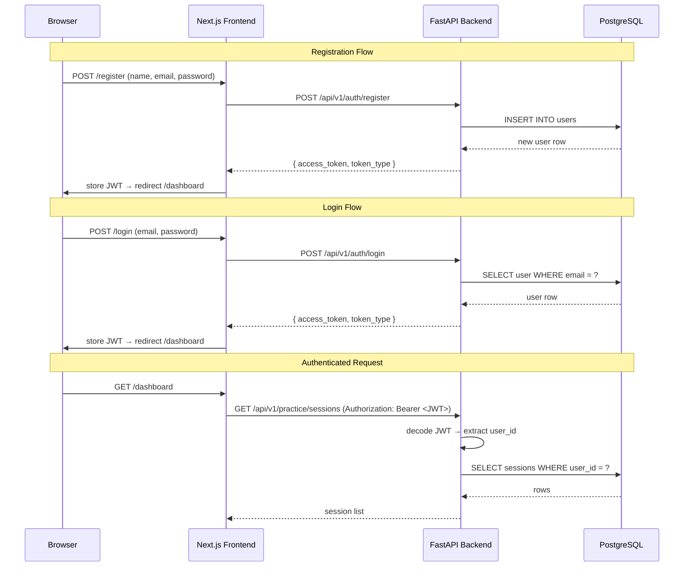

# Design Document — User Authentication & Login

## Overview

This feature adds a complete authentication layer to the Candidate Practice Portal. It introduces two new frontend pages (`/login`, `/register`), two new backend API endpoints (`POST /api/v1/auth/login`, `POST /api/v1/auth/register`), a client-side route guard, and a logout action in the Sidebar. The existing `users` table already has the required schema (`email`, `hashed_password`, `full_name`), so no database migration is needed.

The current codebase uses a hardcoded `_DEFAULT_USER_ID` in `api/routers/practice.py`. After this feature is implemented, the `get_current_user_id` dependency will decode the JWT from the `Authorization` header instead.

---

## Architecture



---

## Components and Interfaces

### Backend — `api/routers/auth.py`

New FastAPI router mounted at `/auth`.

```
POST /api/v1/auth/register
  Body:  RegisterRequest { full_name, email, password }
  200:   TokenResponse   { access_token, token_type: "bearer" }
  409:   { detail: "Email already registered." }

POST /api/v1/auth/login
  Body:  LoginRequest    { email, password }
  200:   TokenResponse   { access_token, token_type: "bearer" }
  401:   { detail: "Invalid email or password." }
```

### Backend — `api/dependencies.py` (updated)

`get_current_user_id` is updated to decode the JWT from the `Authorization: Bearer <token>` header. It raises HTTP 401 if the token is missing, expired, or invalid.

### Backend — `config.py` (updated)

Two new settings added:
- `JWT_SECRET_KEY: str` — loaded from `.env`
- `JWT_ALGORITHM: str = "HS256"`
- `JWT_EXPIRE_HOURS: int = 24`

### Frontend — `frontend/app/login/page.tsx`

Client component. Renders a centered card with:
- Email input (type=email, required)
- Password input (type=password, required)
- Submit button with loading state
- Inline field-level validation errors
- Link to `/register`

On success: stores JWT in `localStorage["auth_token"]`, redirects to `/dashboard`.

### Frontend — `frontend/app/register/page.tsx`

Client component. Renders a centered card with:
- Full name input (required)
- Email input (type=email, required)
- Password input (type=password, min 8 chars)
- Confirm password input
- Submit button with loading state
- Inline field-level validation errors
- Link to `/login`

On success: stores JWT in `localStorage["auth_token"]`, redirects to `/dashboard`.

### Frontend — `frontend/components/AuthGuard.tsx`

Client component wrapper. Reads `localStorage["auth_token"]` on mount. If absent, redirects to `/login`. If present, renders children. Used in the root layout to wrap all non-auth routes.

### Frontend — `frontend/lib/api.ts` (updated)

- `loginUser(email, password)` — calls `POST /api/v1/auth/login`
- `registerUser(fullName, email, password)` — calls `POST /api/v1/auth/register`
- All existing fetch calls updated to include `Authorization: Bearer <token>` header via a shared `authHeaders()` helper that reads from `localStorage`.

### Frontend — `frontend/components/Sidebar.tsx` (updated)

Adds a logout button at the bottom of the sidebar. On click: removes `auth_token` from `localStorage`, redirects to `/login`.

### Frontend — `frontend/app/layout.tsx` (updated)

Wraps `<main>` with `<AuthGuard>` so all pages except `/login` and `/register` are protected.

---

## Data Models

### Pydantic Schemas (backend)

```python
# schemas/auth.py

class RegisterRequest(BaseModel):
    full_name: str
    email: EmailStr
    password: str  # plain-text, min 8 chars validated here

class LoginRequest(BaseModel):
    email: EmailStr
    password: str

class TokenResponse(BaseModel):
    access_token: str
    token_type: str = "bearer"
```

### JWT Payload

```json
{
  "sub": "<user_uuid>",
  "exp": <unix_timestamp>
}
```

### Frontend Types

```typescript
// types/auth.ts
export interface TokenResponse {
  access_token: string;
  token_type: string;
}
```

---

## Error Handling

| Scenario | Backend Response | Frontend Behavior |
|---|---|---|
| Empty field on submit | — (client-side) | Inline error, no request sent |
| Invalid email format | — (client-side) | Inline error, no request sent |
| Password < 8 chars | — (client-side) | Inline error, no request sent |
| Passwords don't match | — (client-side) | Inline error, no request sent |
| Email already registered | HTTP 409 | Toast/inline: "Email already registered." |
| Wrong email or password | HTTP 401 | Toast/inline: "Invalid email or password." |
| Server error | HTTP 500 | Toast/inline: "Something went wrong. Try again." |
| Expired/invalid JWT | HTTP 401 from any endpoint | AuthGuard clears token, redirects to `/login` |

---

## Testing Strategy

- Unit tests for the `auth` router: register success, duplicate email 409, login success, wrong password 401.
- Unit tests for the updated `get_current_user_id` dependency: valid token, missing token, expired token.
- Frontend component tests for `LoginPage` and `RegisterPage`: field validation, loading state, success redirect, error display.
- The existing `_DEFAULT_USER_ID` stub in `practice.py` is replaced by the real JWT dependency, so existing integration tests will need to pass a valid token or be updated to mock the dependency.
